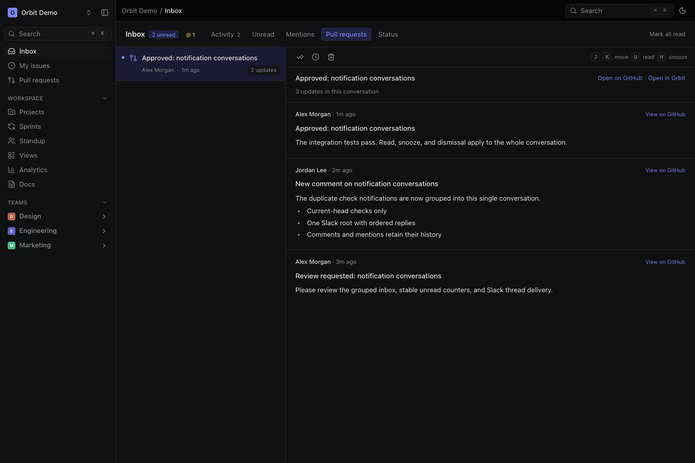
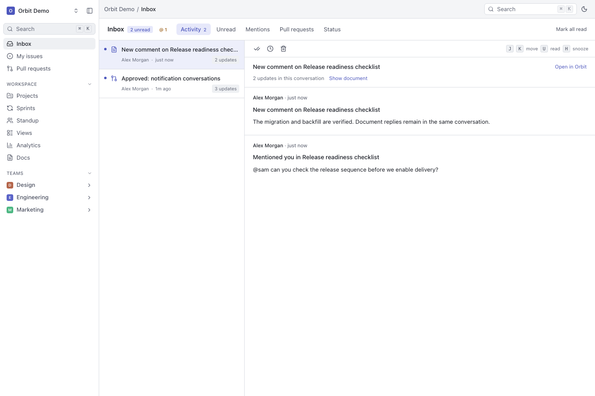

# Inbox conversations

The grouped inbox gives each subject a conversation with an ordered event history.
It does not create another list entry for every review comment or failed job.





These screenshots use a local demo workspace, not production member data.

## What people receive

| Activity | Inbox grouping | Personal delivery |
| --- | --- | --- |
| PR comments, inline comments, reviews, review requests, merges, closes and failed checks | One conversation per repository and PR | Authorized author, reviewer or linked-issue audience, according to event and preferences |
| Issue comments, replies, mentions and other activity | One issue activity conversation | Relevant assignees, creators, subscribers or mentioned people |
| Issue assignments, status and priority changes | Separate issue status conversation | The event's authorized audience |
| Document comments, replies, mentions and document changes | One document activity conversation | Relevant authors, subscribers or mentioned people who can still read the document |
| Project updates and other supported events | Their canonical subject conversation | The event's authorized audience |

Not every workspace member receives every update. Member sync matches Orbit
members to Slack users by one exact normalized email match. It enables routing,
but delivery still requires an event addressed to that person, current access
and an enabled channel preference. The event actor is normally excluded.

GitHub check notifications describe current PR-head transitions. Old-head
failures remain history without changing current status. Several failing jobs
on one commit do not create several failure notifications.

## Reading and triage

Activity, Status, Unread, Mentions and Pull requests filter on the server before
pagination. Unread badges count conversations. Read and unread actions apply to
the conversation; manual unread does not invent a mention. Snooze hides the
conversation until its scheduled wake. Dismiss keeps the history. New live
activity resurfaces a snoozed or dismissed conversation.

J/K move through conversations, U toggles read, H snoozes and Backspace dismisses.
The history retains links to the original update and its Orbit subject.
Access is checked again for list, history, mutations and provider delivery.

## Slack and email

Slack uses one root per integration, Slack workspace/app, destination and
conversation. Later events are compact replies in that thread, with broadcast
disabled. Personal DMs and admin-managed channel mappings are separate routes.
A PR connected to several issues does not multiply messages to the same channel.

Notification email uses Resend and a verified address. Neither Slack nor email
is recorded as delivered until the provider confirms a message identity.

| Delivery state | Meaning |
| --- | --- |
| `pending` | Queued for the worker |
| `processing` | Owned by a time-limited claim |
| `failed` | Definitive retryable failure, waiting for backoff |
| `delivered` | Provider confirmation recorded |
| `unavailable` | Access, mapping, preference or configuration prevents delivery |
| `ambiguous` | The send may have succeeded; automatic resend is blocked |
| `dead_letter` | Retry budget exhausted |

Do not reset an ambiguous Slack delivery to pending without checking the
destination for the original message. There is no documented Slack send
idempotency guarantee. A reconnect to another Slack team/app cannot reuse an old
destination or thread. Notification email freezes its first attempted request
and reuses its idempotency key only within the permitted retention window.

## Deployment and migration

`SLACK_ENABLED=true` makes Slack available globally, not per organization.
Each organization still authorizes its own Slack connection. The following
operational switches are independent of organization entitlement:

- `NOTIFICATION_CONVERSATIONS_ENABLED=true` selects grouped web inbox reads.
  False or unset retains the legacy view while compatibility writes continue.
- `NOTIFICATION_PROVIDERS_PAUSED=true` pauses notification provider claims.
  Queued rows remain stored; GitHub reconciliation and snooze wakes continue.

Before enabling grouped reads or new provider claims:

1. Take a database backup, inspect notification volumes and set bounded release
   lock/statement timeouts. Drain old webhook and provider handlers before the
   migration. Do not run old tokenless webhook handlers alongside this rollout.
2. Apply the complete committed migration chain with `bun run db:release` using
   the target's direct database connection. Verify schema and ledger equivalence.
3. Deploy compatibility writes with grouped reads disabled and providers paused.
4. Run the bounded historical backfill and then the verifier against that target:

   ```bash
   bun run notifications:conversations-backfill --all --batch-size=100 --max-batches=1000
   bun run notifications:conversations-verify --all
   ```

   For a scoped rehearsal, replace `--all` with `--organization=<id>`. Global
   execution requires explicit `--all`; it is not the default. Rerun incomplete
   batches until all phases finish. Two unchanged empty tail sweeps are required.
   Ambiguous historical subjects remain separate rather than being guessed.
5. Require zero verifier drift and resolve uncertain historical provider sends.
   Test a comment, PR review, document reply, read/snooze action and controlled
   Slack destination before enabling grouped reads and unpausing providers.

Roll back reads by clearing `NOTIFICATION_CONVERSATIONS_ENABLED`; pause provider
claims with `NOTIFICATION_PROVIDERS_PAUSED=true`. Do not drop conversation,
source, audit or delivery data. Existing event-level APIs and MCP tools retain
their IDs during the compatibility window; conversation tools are additive.
