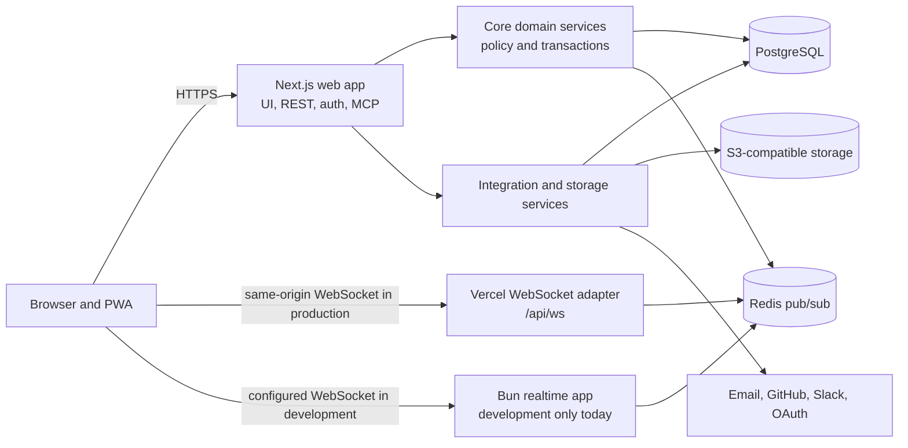
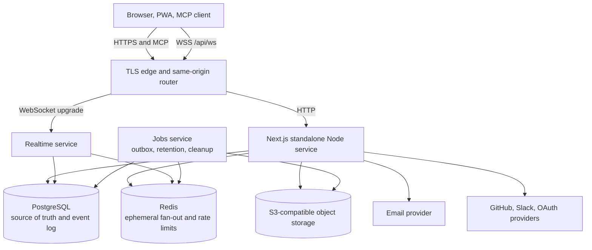
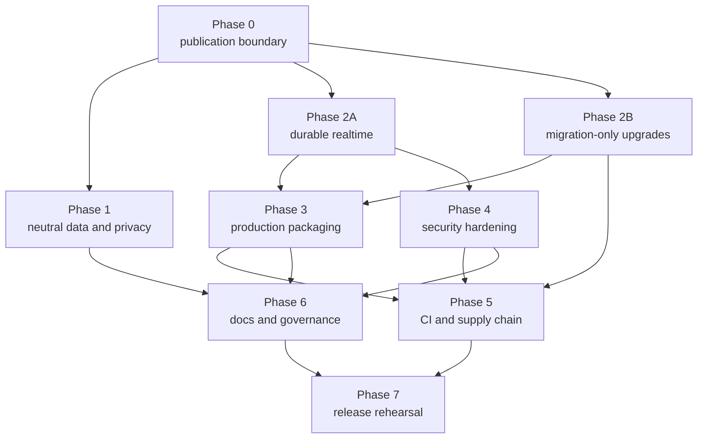

# Open Source Readiness and Self-Hosting Implementation Plan

> Status: proposed. This document records an audit of commit `f1bfdc3` on 2026-08-09 and a task-by-task implementation sequence. It does not claim that the remediation work is complete.

**Goal:** Make Orbit safe, organization-neutral, reproducible, and supportable so a new organization can clone, configure, run, upgrade, back up, and operate it without Noveum or Yodu data, undocumented infrastructure, or vendor-specific assumptions.

**Architecture:** Keep the existing Next.js application and acyclic workspace package graph. Preserve Vercel as one supported deployment profile, add a provider-neutral container profile with the existing realtime service behind the same origin, move realtime recovery to a durable PostgreSQL event log and outbox, and make committed migrations the only production schema upgrade path.

**Tech stack:** Bun workspace tooling, Next.js 16 on Node.js, React 19, PostgreSQL and Drizzle, Redis, S3-compatible object storage, Better Auth, WebSockets, MCP, Biome, Bun Test, Playwright, Docker Compose, GitHub Actions, CodeQL, Dependabot, and Gitleaks.

## How to use this plan

- Treat each `P0` item as a public-release gate. A priority is not a CVSS rating.
- Implement tasks in dependency order. Do not combine unrelated security, migration, portability, and documentation changes in one pull request.
- Start each behavior change with a failing test. Every task lists the minimum verification expected.
- Run `bun run verify` after each task and the phase-specific checks before merging a phase.
- Preserve Apache 2.0 attribution and `NOTICE`. Organization-neutrality does not mean deleting lawful upstream ownership, funding, repository, or security-contact information.
- Never copy private configuration, source exports, Slack object URLs, personal photos, or production database values into tests or documentation.
- Record an ADR whenever implementation changes a recommendation in this plan.

## Executive assessment

Orbit already has a strong open-source foundation: an Apache 2.0 license, a notice file, security policy, code of conduct, contribution guide, issue and pull request templates, CodeQL, Dependabot, strict TypeScript, a clear workspace dependency direction, centralized authorization, and extensive integration and adversarial tests.

It is not ready to be advertised as a turnkey, provider-neutral self-hosted product yet. The highest-risk gaps are:

1. Missed realtime hard deletes cannot be reconstructed after Redis or connection failure.
2. Production upgrade documentation uses `drizzle-kit push --force` instead of the committed migrations tested by CI.
3. The documented standalone server cannot host the Vercel-specific `/api/ws` upgrade, there is no production Docker image, and the checked-in `start` script points to a file that does not exist.
4. Seed, import, catchup, screenshot, test, and avatar tooling contains Noveum, Yodu, personal identities, internal mappings, or external account identifiers.
5. Upload and invitation paths have no durable abuse quotas, and abandoned uploads are not pruned.
6. MCP grants, integration OAuth callbacks, uploaded avatar content, Markdown rendering, and response headers need security hardening.
7. The current dependency audit is red, and the main CI workflow does not run every local verification gate or pin every action and image immutably.
8. A one-click deployment can start without any usable first-login method, retention scheduler, or complete health check.

No likely live credential was found in the tracked tree or Git history. Gitleaks reported only reviewed CI placeholders and published test vectors. This is a useful result, not proof that externally managed credentials have been rotated or that personal data is approved for public redistribution.

## Priority and release policy

| Priority | Meaning | Release rule |
| --- | --- | --- |
| P0 | Security, data consistency, installability, privacy, or upgrade blocker | Must be complete before a supported public preview |
| P1 | Required for a dependable supported release | Must be complete before declaring a stable release |
| P2 | Maintainability, contributor experience, or defense in depth | Schedule immediately after the supported release unless pulled forward |
| P3 | Optional product polish or ecosystem expansion | Backlog with an owner and rationale |

The first supported public release must have zero accepted P0 findings. Any accepted P1 exception needs a written owner, expiry date, mitigation, and public limitation.

## Audit scope and evidence standard

### Repository scope

- 1,253 tracked files at audited commit `f1bfdc3`
- 795 files under `apps/`
- 364 files under `packages/`
- 344 tracked unit or integration test files
- 13 Playwright specification files
- 117 Next.js route handlers
- 26 tracked product screenshots
- Approximately 152,000 lines of TypeScript, TSX, and CSS

The audit covered source, package manifests, schema and migrations, catchup SQL, scripts, tests, screenshots, documentation, GitHub workflows, Docker Compose, ignored-file behavior, the current dependency graph, and 628 Git commits for secret patterns.

### Validation performed

- Tracked-file and package inventory
- Exact searches for organization names, domains, personal names, email addresses, identifiers, analytics vendors, deployment IDs, and common secret formats
- Gitleaks scan of the current tracked snapshot and Git history, with every candidate manually classified
- `bun audit --json` and dependency-path inspection
- Static review of authentication, authorization, invitations, MCP, OAuth callbacks, uploads, storage, Markdown, webhooks, realtime, retention, health, environment validation, and CI
- Production build with `bun run build`
- Repository verification with `bun run verify`
- Direct inspection of the installed `@vercel/functions` WebSocket adapter
- Direct inspection and OCR of representative tracked screenshots

### Limitations

- This is a repository audit, not a formal external penetration test.
- No production cloud account, bucket policy, Redis ACL, database role, DNS, TLS, Vercel project, email domain, or GitHub App registration was inspected.
- Vercel WebSocket behavior was verified from the installed adapter and official documentation, not by changing a live deployment.
- Personal names and external avatar URLs were found, but the repository cannot prove whether every person granted redistribution permission.
- Dependency advisories are confirmed present. Reachability is called out separately and must be retested after upgrades.
- Legal conclusions about trademarks, contributor agreements, privacy law, or third-party image rights need qualified review.

## Verified current architecture



### Workspace dependency direction

```text
shared
  -> db
      -> services
          -> core
  -> realtime-client
  -> realtime-server
  -> mcp-server, which also depends on core and db
  -> web, which composes all packages
```

This graph is acyclic, and no package was found importing another workspace through an internal `src` path. A large repository restructuring is not warranted. Remediation should reinforce the existing boundaries and split only the oversized modules that currently concentrate risk.

## Existing controls to preserve

- Authorization is centralized in `packages/shared/src/policy` and re-resolved from database membership at server boundaries.
- Cross-tenant, role-escalation, invite, session-revocation, and team-scope adversarial tests are extensive.
- Drizzle queries are parameterized, and the few raw SQL uses are constrained.
- Realtime tickets are short-lived and HMAC verified. Membership, session, scope, subscription, rate, and outbound-buffer controls already exist.
- GitHub and Slack webhook signatures are verified, Slack timestamps have a replay window, and GitHub delivery rows support most retry and deduplication behavior.
- Markdown removes scripts, active embedded elements, unsafe URL schemes, and unsafe link targets. The remaining finding concerns permitted classes and remote images.
- Upload keys are tenant-scoped and sanitized, attachment authorization is server-side, and download names use safe content disposition.
- CodeQL, Dependabot, strict TypeScript, Biome, the comment check, source-byte check, Bun-import check, dependency dedupe check, package-local tests, and Playwright already exist.
- `LICENSE`, `NOTICE`, `SECURITY.md`, `CODE_OF_CONDUCT.md`, `CONTRIBUTING.md`, CODEOWNERS, funding, issue forms, discussion forms, and a pull request template already exist.
- No third-party product analytics or error-tracking identifier was found. Web Vitals are stored inside the tenant database.

## Organization-specific material classification

| Material | Decision | Reason |
| --- | --- | --- |
| Apache 2.0 copyright and `NOTICE` attribution | Retain | Legal provenance and license compliance |
| Canonical `Noveum/orbit` source URL, upstream issue URL, funding, CODEOWNERS, and security contact | Retain in upstream; document fork checklist | These identify the actual upstream project and maintainers |
| Orbit product name and package names | Retain as defaults | Orbit is the open-source product, not an organization tenant |
| Visible sponsor and source links | Centralize and make configurable | Upstream can keep its defaults; forks should not edit many files |
| Seed users, emails, workspace names, domains, assignments, and screenshots | Replace | They use Noveum identities and personal-looking data |
| Noveum/Yodu fixed organization IDs and domain lists | Remove from public setup path | They make generic seed and import commands tenant-specific |
| API.market, NovaSynth, team, project, timezone, and fallback-user import mappings | Move to ignored external configuration | They are source-organization policy, not Orbit behavior |
| Tenant-specific Yodu catchup SQL | Remove from public operational commands | It targets two fixed organization IDs |
| Slack avatar manifest with personal names and object URLs | Remove and review history | It is a private operations artifact with uncertain redistribution rights |
| Internal execution plans and branch/review-bot notes | Remove or distill into sanitized ADRs | Durable design belongs in public docs; internal operations do not |
| Real-looking GitHub installations, private repository names, and personal email fixtures | Replace | Tests need synthetic values, not production-shaped identifiers |

## Findings register

| ID | Priority | Finding | Verified evidence | Required outcome |
| --- | --- | --- | --- | --- |
| RT-001 | P0 | Realtime catch-up cannot replay hard deletes, and publish failures are swallowed after commit | `packages/core/src/work/issue-service.ts`, `packages/core/src/realtime/backfill.ts`, `apps/web/src/lib/api/handler.ts`, `apps/web/src/lib/realtime/delta-bridge.tsx` | Durable event log or tombstones, transactional outbox, retry, gap/reset semantics, failure tests |
| DB-001 | P0 | Production docs use `db:push`, while CI tests committed migrations; catchups have no ledger | `packages/db/package.json`, `packages/db/src/apply-catchup.ts`, `packages/db/src/check-drift.ts`, `docs/self-hosting.md` | Production uses ordered migrations only, existing installs can baseline safely, drift fails closed |
| DEP-001 | P0 | `@orbit/web` starts `bun server.js`, but that file does not exist | `apps/web/package.json`; build emits `.next/standalone/apps/web/server.js` | A tested production start command and artifact smoke test |
| DEP-002 | P0 | The standalone Node server cannot use the Vercel-only WebSocket upgrade adapter | `apps/web/src/app/api/ws/route.ts`, installed `@vercel/functions/websocket/index.js`, `docs/self-hosting.md` | Same-origin proxy to a separately deployed realtime service for provider-neutral installs |
| DEP-003 | P0 | No production Dockerfile or full application Compose exists | `docker-compose.yml`, `docs/self-hosting.md` | Reproducible images and a production-oriented Compose profile |
| DEP-004 | P0 | The deploy button can create an instance with no usable first-login mechanism | `README.md`, `apps/web/src/lib/auth/server.ts`, email transport | Production validation requires at least one complete auth path |
| DEP-005 | P1 | Development Compose binds default-credential services broadly, uses mutable MinIO tags, and implicitly parses the application `.env` | `docker-compose.yml`, `.env.example` | Loopback-only development services, separate Compose environment, immutable image pins |
| PORT-001 | P0 | Seed and import tooling fixes Noveum IDs, names, domains, people, timezone, fallback user, and source mappings | `packages/db/src/noveum-workspace.ts`, `packages/db/src/seed`, `packages/db/src/import` | Fictional demo profile and argument-driven, dry-run-first importers |
| PRIV-001 | P0 | A tracked script contains personal identities and Slack avatar object URLs; screenshots contain Noveum people and branding | `scripts/import-avatars.ts`, `docs/assets/screenshots` | Remove private manifest, replace media, complete owner and history review |
| SEC-001 | P0 | Contributors can repeatedly register 100 MiB uploads without quota, rate, concurrency, or abandoned-object cleanup | upload constants, attachment service, `packages/db/src/prune.ts` | Durable quotas, lifecycle cleanup, reconciliation, abuse tests |
| SEC-002 | P0 | Members can send batches of 100 invites and resend without a cooldown or durable limiter | invite validators, routes, and service | User, tenant, IP, recipient, and provider limits with safe retries |
| SEC-003 | P0 | Existing MCP tokens can move to a newly consented tenant and retain old scopes | `packages/db/src/schema/oauth.ts`, `packages/core/src/auth/mcp-token.ts` | Immutable token-to-grant binding and revocation on re-consent or scope change |
| SEC-004 | P0 | Integration callbacks use stored OAuth state without rechecking the user's current admin role | Slack and GitHub start/callback/connect modules | Permission recheck before exchange and again at the transactional write |
| SEC-005 | P0 | Avatar uploads can spoof content type and serve active content from storage; provider avatars are fetched without SSRF or streamed-size controls | avatar routes, storage S3 driver, avatar service | Decode and transcode images, fixed MIME, isolated serving, safe outbound fetch |
| SEC-006 | P0 | Current dependency audit includes high and moderate advisories | `bun.lock`, MCP SDK dependency graph | Upgrade or override to patched versions and make audit policy a CI gate |
| SEC-007 | P1 | Markdown permits arbitrary CSS classes and remote images | Markdown sanitizer and document renderer | Narrow class policy and privacy-safe remote-image policy |
| SEC-008 | P1 | No application-wide CSP, frame, MIME, referrer, permissions, or production HSTS baseline | `apps/web/next.config.ts`, reverse-proxy sample | Tested headers with a staged CSP rollout |
| SEC-009 | P1 | Production accepts localhost HTTP URL defaults and a 16-character auth secret | web and realtime environment schemas | Fail production startup on missing, placeholder, weak, non-HTTPS, or inconsistent settings |
| SEC-010 | P1 | JSON, webhook, and WebSocket inputs lack consistent application-level byte limits | API handler, direct route parsers, webhook routes, realtime adapters | Central bounded readers and explicit adapter limits |
| SEC-011 | P1 | Email delivery retains recipients and raw magic, reset, or invite token material without a retention policy | auth email calls, invite sender, comms schema, prune list | HMAC token-derived keys, tenant ownership, deletion, retention |
| SEC-012 | P1 | Slack integration settings GET exposes private channel metadata to roles without `integration:manage` | `apps/web/src/app/api/integrations/slack/route.ts` | Server permission check and denial tests |
| SEC-013 | P1 | Account linking allows different emails and unlinking all credentials globally | `apps/web/src/lib/auth/server.ts` | Default-safe linking, step-up, recovery, and threat-model tests |
| SEC-014 | P1 | Public realtime health exposes runtime and topology detail | realtime health route | Minimal public readiness and protected diagnostics |
| SEC-015 | P1 | OAuth and integration bearer credentials and webhook secrets are stored as plaintext database fields | auth, OAuth, and comms schemas | Framework token encryption plus versioned envelope encryption and rotation for application-managed secrets |
| SEC-016 | P1 | Cookie-authenticated custom routes have no shared Origin or fetch-metadata gate, and distributed rate limiting is limited to selected paths | API handler and auth configuration | Central unsafe-method request policy and shared abuse-control service |
| SEC-017 | P1 | Runtime and migration database authority is not separated in the documented deployment model | database configuration and self-host docs | Least-privilege runtime roles, separate migration authority, encrypted service connections |
| REL-001 | P1 | `/api/health` is static, Redis may silently disable realtime, and pruning requires undocumented `CRON_SECRET` | health, publisher, cron, env docs | Liveness/readiness split, required capability validation, scheduled jobs |
| INT-001 | P0 | GitHub setup docs request write access and a Push event that current code does not need or handle | `docs/integrations.md`, `docs/github-app.md`, GitHub services | One least-privilege permission manifest and generated/tested docs |
| MCP-001 | P1 | Every MCP tool declares `destructiveHint: false`, including permanent deletes | MCP tool support and workspace tools | Accurate destructive, read-only, idempotent, and open-world annotations |
| CI-001 | P0 | CI omits source-byte and Bun-runtime gates and does not test the production deployment shape | root scripts and `.github/workflows/ci.yml` | CI parity plus production artifact, Compose, migration, and realtime smoke tests |
| CI-002 | P1 | Main CI action tags and some container tags are mutable; workflow permissions are not explicit | main CI and Compose | SHA or digest pins, least privilege, no persisted credentials |
| REL-002 | P1 | No tags, changelog, release workflow, version source, image publication, SBOM, or upgrade window exists | Git refs, package versions, docs, workflows | Repeatable signed releases with migration notes and provenance |
| CFG-001 | P1 | Configuration is validated in scattered modules and documentation overstates startup validation | web env, db client, storage, email, realtime | Capability-aware typed configuration and `doctor` command |
| DOC-001 | P1 | Architecture and setup docs contain contradictions and omit operator runbooks | README and `docs/` | Tested quickstarts, diagrams, config reference, backup, restore, upgrade, incident docs |
| REPO-001 | P1 | Contributor rules, generated files, tests, Biome exceptions, and CI behavior contradict one another | AGENTS, CLAUDE, nested AGENTS, Biome, testing docs | One enforceable policy with documented scopes and exceptions |
| REPO-002 | P2 | Several domain services are oversized and test-support placement is inconsistent | core services and web test support files | Split by command/query responsibility after behavioral safety nets exist |

### Current advisory evidence

As of 2026-08-09, `bun audit --json` reports three high-severity transitive packages and several moderate packages. The high advisories include:

- [`fast-uri` host-confusion advisory](https://github.com/advisories/GHSA-7p8r-x3mc-p8w7), patched in the affected major line at 3.1.5
- [`ip-address` resolver disagreement advisory](https://github.com/advisories/GHSA-mwp4-54f8-5fhr), patched at 10.3.1
- [`nanoid` zero-size custom-generator advisory](https://github.com/advisories/GHSA-2v37-7h3g-55p8)

The MCP SDK pulls the current Hono, `fast-uri`, and `ip-address` paths. Direct exploit reachability in Orbit was not established, so remediation must update, test, and reassess rather than claim an exploitable dependency path. Some other reported paths are build or development dependencies.

Better Auth documents `allowDifferentEmails: false` as the default and describes email matching as a protection against cross-account linking. Orbit explicitly enables it. See [Better Auth account options](https://better-auth.com/docs/reference/options) and [user account linking](https://better-auth.com/docs/concepts/users-accounts). This is a threat-model decision, not proof of an existing account takeover.

GitHub recommends requesting the minimum GitHub App permissions needed by the implemented API and webhook set. See [GitHub App permission guidance](https://docs.github.com/en/apps/creating-github-apps/registering-a-github-app/choosing-permissions-for-a-github-app).

## Target supported deployment architecture



### Supported profiles

| Profile | WebSocket adapter | Job execution | Intended use |
| --- | --- | --- | --- |
| Vercel | Same-origin `/api/ws` through `@vercel/functions` | Vercel cron invokes shared job handlers | Official managed deployment profile |
| Container | Reverse proxy sends `/api/ws` to `apps/realtime`; all other routes to standalone Next | Dedicated jobs container or scheduled command | Provider-neutral production self-hosting |
| Local development | Next dev plus `apps/realtime`, configured by local URL | Developer-invoked setup and test commands | Contributor workflow only |

The provider-neutral profile must not call the Vercel WebSocket upgrade function. The installed adapter explicitly requires a supporting Vercel runtime. The reverse proxy should preserve the same public `/api/ws` URL so the browser does not need a production cross-origin override.

## Implementation principles

1. PostgreSQL is the durable source of truth. Redis loss can reduce immediacy but cannot create unrecoverable client state.
2. Production builds are offline and reproducible. Database reachability and migration happen in explicit predeploy and readiness steps.
3. Every enabled capability is validated at startup. Disabled optional capabilities are visible in readiness and UI, not discovered by a user-facing failure.
4. Every tenant-sensitive read and write accepts or derives an authenticated principal and enforces policy in the domain layer.
5. External data is untrusted, including OAuth profile images, provider webhooks after signature validation, object metadata, and Markdown HTML.
6. Public defaults are fictional and safe. Upstream ownership is retained in legal and project metadata, while organization data is configuration.
7. One command should prove the same contract locally and in CI.
8. Release artifacts, migrations, documentation, and container images are versioned together.

---

## Phase 0: Publish boundary and evidence preservation

### Task 0.1: Freeze the supported-release claim

**Files:**

- Modify: `README.md`
- Modify: `docs/README.md`
- Modify: `docs/self-hosting.md`
- Create: `docs/open-source-readiness.md`

- [ ] State that the current self-hosting path is preview quality until the P0 gates in this plan are complete.
- [ ] Remove or qualify any claim that Docker and generic standalone realtime are already supported.
- [ ] Link the readiness page to this plan and publish the verified limitations without security-sensitive exploit detail.
- [ ] Define who can close each P0 finding and where evidence is recorded.
- [ ] Test every README and docs command in a clean checkout.

**Verification:** `bun run verify` and a documentation link check.

**Suggested commit:** `docs: state the current self-hosting support boundary`

### Task 0.2: Complete privacy and history ownership review

**Files:**

- Delete or replace: `scripts/import-avatars.ts`
- Review: `docs/assets/screenshots/*.png`
- Review: `packages/db/src/seed/data.ts`
- Review: all tracked files and Git history containing personal names, emails, Slack URLs, GitHub IDs, and private-looking repository names
- Create: `docs/maintainers/publication-review.md`

- [ ] Obtain a human determination for every personal name, photo, external avatar URL, and private-looking repository fixture.
- [ ] Remove the Slack avatar manifest from the public tree and revoke or invalidate externally hosted object URLs where possible.
- [ ] Decide whether the public repository keeps history, rewrites selected blobs, or launches from a reviewed clean export. Record the tradeoff and approvals before any history rewrite.
- [ ] Replace current-tree data first, then rerun a redacted Gitleaks scan and a personal-data pattern scan.
- [ ] Never include matched values in public CI logs or issue comments.

**Verification:** Gitleaks current-tree and history scans return only documented allowlisted fixtures; screenshot review is signed off by an owner.

**Suggested commit:** `chore: remove private publication artifacts`

### Task 0.3: Establish an auditable finding ledger

**Files:**

- Create: `docs/maintainers/readiness-ledger.md`
- Modify: `.github/PULL_REQUEST_TEMPLATE.md`
- Modify: `.github/ISSUE_TEMPLATE/config.yml`

- [ ] Copy every P0 and P1 finding ID into a ledger with owner, status, pull request, evidence, and residual risk.
- [ ] Require pull requests closing a finding to link the failing test added first and the passing release gate.
- [ ] Use GitHub security advisories for vulnerability details that should not be public before a fix.
- [ ] Keep this implementation plan as the stable scope document and the ledger as changing execution state.

**Verification:** every P0 finding has an owner and an objective close condition.

**Suggested commit:** `docs: add the open source readiness ledger`

---

## Phase 1: Remove organization coupling and publish safe demo data

### Task 1.1: Replace the Noveum seed profile with a fictional demo profile

**Files:**

- Delete or rename: `packages/db/src/noveum-workspace.ts`
- Create: `packages/db/src/seed/demo-profile.ts`
- Modify: `packages/db/src/seed/index.ts`
- Modify: `packages/db/src/seed/data.ts`
- Modify: `packages/db/tests/seed/*`
- Modify: `docs/getting-started.md`
- Modify: `README.md`
- Modify: `CONTRIBUTING.md`
- Modify: `.github/ISSUE_TEMPLATE/bug_report.yml`

- [ ] Add tests that reject `noveum`, `yodu`, real maintainer names, and non-reserved email domains in the public demo profile.
- [ ] Define a deterministic fictional company, fictional people, `example.com` addresses, neutral roles, and neutral project content.
- [ ] Use generic stable fixture IDs only where deterministic E2E state requires them. Generate normal organization IDs in product flows.
- [ ] Remove `Asia/Kolkata` as a forced seed default. Use an explicit demo timezone such as UTC while preserving per-user timezone behavior in tests.
- [ ] Replace the privileged fallback email and every assignment keyed to a real person.
- [ ] Update getting-started, contribution, issue-template, and screenshot-login instructions from one shared demo identity source.
- [ ] Run seed twice against a disposable database and prove deterministic, idempotent behavior or document the required reset.

**Verification:** seed tests, fresh database setup, login as each fictional role, `rg -n -i 'noveum|yodu|pulkit|shashank' packages/db/src/seed docs/getting-started.md README.md CONTRIBUTING.md .github/ISSUE_TEMPLATE`.

**Suggested commit:** `feat(seed): provide organization neutral demo data`

### Task 1.2: Turn Plane and combined importers into safe generic CLIs

**Files:**

- Modify: `packages/db/src/import/index.ts`
- Modify: `packages/db/src/import/combined.ts`
- Modify: `packages/db/src/import/surgical.ts`
- Modify: `packages/db/src/import/combine.ts`
- Modify: `packages/db/src/import/plane-mapping.ts`
- Modify: `packages/db/package.json`
- Modify: `scripts/fetch-plane.ts`
- Modify: `.env.example`
- Create: `docs/importing.md`
- Create: `packages/db/tests/import/config.test.ts`
- Create: `packages/db/tests/import/dry-run.test.ts`

- [ ] Define Zod-parsed CLI options for organization ID, name, slug, default timezone, fallback user, source mapping file, storage path, and single-team behavior.
- [ ] Make source workspace, organization identity, and mapping file required when relevant. Do not retain `noveum-ai` or another tenant as a default.
- [ ] Move API.market, NovaSynth, team, project, and person mapping data into an ignored example-driven JSON schema.
- [ ] Add `--dry-run` as the default behavior for destructive or bulk import commands. Require an explicit confirmation containing the target database and organization for writes.
- [ ] Print a redacted plan with counts, target tenant, unresolved users, mapping collisions, and destructive operations before applying.
- [ ] Make the Plane export heading use the configured workspace slug.
- [ ] Add rollback guidance and state clearly which import operations are not reversible.

**Verification:** parser tests, dry-run snapshot, invalid-config tests, import into a disposable fictional tenant, and proof that no other tenant changes.

**Suggested commit:** `refactor(db): make import tooling tenant configurable`

### Task 1.3: Remove tenant catchups and internal operational plans

**Files:**

- Remove: `packages/db/catchup/noveum-yodu-domain-catchup.sql`
- Remove or sanitize: `docs/superpowers/plans/2026-08-08-yodu-email-domain.md`
- Remove or sanitize: `docs/superpowers/specs/2026-08-08-yodu-email-domain-design.md`
- Review: every file under `docs/superpowers/plans/` and `docs/superpowers/specs/`
- Modify: `.gitignore`
- Create: `docs/adr/README.md`

- [ ] Prove that the tenant-specific catchup is not required to construct a fresh generic schema.
- [ ] Move any still-needed operator command to a private, ignored location outside shipped scripts.
- [ ] Distill durable architectural decisions into ADRs without branch names, review-bot logs, production identifiers, or current-database instructions.
- [ ] Define a retention rule: public plans describe reusable project work; tenant operations remain outside the repository.
- [ ] Keep this open-source readiness plan public until completion, then distill its durable decisions and archive its execution state.

**Verification:** fresh migrations and generic seed complete without any removed file; organization-specific search allowlist contains only intentional upstream/legal references.

**Suggested commit:** `docs: remove tenant specific operations material`

### Task 1.4: Replace personal-looking tests and regenerate media

**Files:**

- Modify: tests containing Noveum, Yodu, real-looking email addresses, GitHub installation IDs, or private repository names
- Modify: `apps/web/scripts/capture-screenshots.ts`
- Replace: `docs/assets/screenshots/*.png`
- Create: `apps/web/tests/fixtures/identities.ts`
- Create: `apps/web/tests/fixtures/integrations.ts`
- Create: `docs/maintainers/media-review.md`

- [ ] Centralize fictional user, organization, repository, installation, and provider fixtures.
- [ ] Use reserved domains and obviously synthetic numeric identifiers.
- [ ] Ensure private-repository tests use names such as `example-org/private-example`, not acquisition or internal project language.
- [ ] Capture every screenshot from a freshly seeded fictional database in both themes and at documented viewport sizes.
- [ ] Visually inspect screenshots for names, email addresses, avatars, repository names, browser chrome, notifications, and accidental secrets.
- [ ] Record asset provenance and redistribution rights for logos, icons, fonts, and generated avatars.

**Verification:** all affected unit and E2E suites, screenshot capture command, OCR/pattern scan, and human media checklist.

**Suggested commit:** `test: replace organization specific fixtures and media`

### Task 1.5: Centralize product branding without erasing upstream attribution

**Files:**

- Create: `packages/shared/src/branding.ts`
- Modify: `apps/web/src/app/layout.tsx`
- Modify: `apps/web/src/app/manifest.ts`
- Modify: `apps/web/src/features/landing/landing-meta.ts`
- Modify: `apps/web/src/features/landing/landing-page.tsx`
- Modify: `apps/web/src/app/llms.txt/route.ts`
- Modify: `apps/web/src/lib/auth/server.ts`
- Modify: `packages/services/src/email/*`
- Modify: `packages/mcp-server/src/server.ts`
- Modify: `packages/mcp-server/src/tools/github.ts`
- Create: `docs/branding-and-forks.md`

- [ ] Define one typed `BrandConfig` with Orbit defaults for product name, public source repository, documentation, support, sponsor, email display name, and public assets.
- [ ] Load server configuration once and pass public fields explicitly to browser components. Never expose server-only environment values.
- [ ] Keep the passkey relying-party identity stable and document that changing it can invalidate credentials.
- [ ] Keep Apache and `NOTICE` attribution separate from optional runtime sponsor copy.
- [ ] Add a fork checklist for package metadata, public URLs, funding, CODEOWNERS, support, security contact, icons, social images, and passkey identity.
- [ ] Decide which overrides are build-time and which are runtime, then test both the Orbit default and one fictional rebrand.

**Verification:** brand configuration tests, metadata and email snapshots, passkey configuration test, and a production build with default and fictional public values.

**Suggested commit:** `feat: centralize public product branding`

### Task 1.6: Add a portability regression gate

**Files:**

- Create: `scripts/check-public-fixtures.ts`
- Create: `scripts/public-fixture-allowlist.json`
- Create: `scripts/tests/check-public-fixtures.test.ts`
- Modify: `package.json`
- Modify: `.github/workflows/ci.yml`

- [ ] Scan public setup, seed, import, tests, screenshots metadata, and runtime copy for disallowed tenant terms, non-reserved fixture domains, Slack object URLs, and private-looking IDs.
- [ ] Keep a narrow path-and-reason allowlist for legal attribution, canonical upstream URLs, funding, and security contacts.
- [ ] Make new allowlist entries require a review reason in the same pull request.
- [ ] Redact matched content in CI output when a pattern could contain a token or private URL.

**Verification:** tests prove forbidden fixtures fail, intentional upstream references pass, and the new check runs in `bun run verify:static`.

**Suggested commit:** `ci: prevent organization specific fixtures from returning`

---

## Phase 2: Make realtime recovery and database upgrades durable

### Task 2.1: Approve the durable sync event and outbox design

**Files:**

- Create: `docs/adr/0001-durable-sync-event-log.md`
- Create: `docs/architecture/realtime-consistency.md`
- Modify: `docs/architecture.md`

- [ ] Specify a transactional `sync_event` record with event ID, tenant, monotonic sync ID, model, model ID, action, authorized scope material, payload or tombstone, actor, creation time, publish state, attempts, and retry time.
- [ ] Specify ordering when one transaction produces several actions with the same sync ID.
- [ ] Specify at-least-once delivery and client idempotency.
- [ ] Define retention and a `reset_required` response when a requested cursor predates retained history.
- [ ] Define how scope changes and deleted teams avoid leaking an old event to a newly unauthorized principal.
- [ ] Define the failure matrix for database commit, Redis publish, worker crash, duplicate publish, reconnect, and expired history.
- [ ] Decide whether outbox and replay log are one table or separate tables, based on measured query and retention needs.

**Verification:** design review covers issue, comment, document, project, label, cycle, view, membership, invite, attachment, and organization deletion actions.

**Suggested commit:** `docs: specify durable realtime recovery`

### Task 2.2: Add the sync event schema through a committed migration

**Files:**

- Modify: `packages/db/src/schema/realtime.ts` or create an equivalent schema module
- Modify: `packages/db/src/schema/index.ts`
- Create: next ordered file under `packages/db/drizzle/`
- Modify: `packages/db/drizzle/meta/_journal.json`
- Create: migration snapshot generated by Drizzle
- Create: `packages/db/tests/schema/sync-event.test.ts`

- [ ] Write failing schema tests for tenant keys, event ordering, retry state, unique event identity, retention lookup, and indexes.
- [ ] Generate the migration with the repository's Bun and Drizzle command. Do not hand-edit the generated journal or snapshot.
- [ ] Add foreign-key and deletion behavior that keeps required tombstones without retaining unnecessary personal data forever.
- [ ] Add indexes for tenant-plus-cursor replay and unpublished retry polling.
- [ ] Prove the migration applies to an empty database and the latest pre-change schema.

**Verification:** schema tests, `bun run db:migrate` on disposable databases, and full catalog inspection.

**Suggested commit:** `feat(db): add durable sync events`

### Task 2.3: Persist sync actions inside each domain transaction

**Files:**

- Modify: `packages/core/src/realtime/publisher.ts`
- Create: `packages/core/src/realtime/event-store.ts`
- Modify: domain services that currently return `SyncAction[]`
- Modify: corresponding tests under `packages/core/tests/`

- [ ] Add failing tests showing a committed mutation and its events are atomic.
- [ ] Add a transaction-scoped event writer and require every action-producing service to call it before commit.
- [ ] Preserve the existing returned actions temporarily for low-latency best-effort publish, but make durable state the recovery authority.
- [ ] Add a guard test that enumerates action-producing domain operations and detects an unpersisted action path.
- [ ] Keep actor and scope derivation inside the authorized transaction.

**Verification:** domain tests, rollback tests, and a database assertion that no committed action-producing mutation lacks an event.

**Suggested commit:** `feat(core): persist realtime events transactionally`

### Task 2.4: Add an idempotent outbox dispatcher and shared job runner

**Files:**

- Create: `packages/core/src/realtime/dispatcher.ts`
- Create: `apps/jobs/package.json`
- Create: `apps/jobs/src/index.ts`
- Create: `apps/jobs/src/env.ts`
- Create: tests under `packages/core/tests/realtime/` and `apps/jobs/tests/`
- Modify: `apps/web/src/app/api/cron/prune/route.ts` or split shared job handlers
- Modify: root workspace scripts

- [ ] Claim retryable events with a bounded batch and PostgreSQL locking that supports multiple workers.
- [ ] Publish to Redis, mark success idempotently, and retry failures with bounded backoff and observable error state.
- [ ] Make worker shutdown graceful and safe during an in-flight batch.
- [ ] Expose commands for one-shot jobs and a long-running container worker.
- [ ] Reuse the same shared job functions from Vercel cron without duplicating policy.
- [ ] Add lag, retry, oldest-unpublished, and last-success health data without exposing it publicly by default.

**Verification:** Redis-down, publish-then-crash, duplicate-worker, retry, and graceful-shutdown tests.

**Suggested commit:** `feat: add the durable jobs runner`

### Task 2.5: Replay events instead of reconstructing current rows

**Files:**

- Replace or refactor: `packages/core/src/realtime/backfill.ts`
- Modify: `packages/core/tests/realtime/backfill.test.ts`
- Modify: `apps/web/src/app/api/sync/route.ts`
- Modify: shared sync response schemas
- Modify: `apps/web/src/lib/realtime/delta-bridge.tsx`
- Modify: `packages/realtime-client/src/index.ts`
- Modify: related web and client tests

- [ ] Add a failing test where a client disconnects, an issue is hard-deleted, Redis publish fails, and catch-up removes the stale issue.
- [ ] Add equivalent representative tests for a child entity and a membership or scope-changing deletion.
- [ ] Query durable events strictly after the cursor, authorize each event for the current principal, and return stable ordered pages.
- [ ] Return `reset_required` when a cursor is missing, ahead of the server, has a gap, or predates retention.
- [ ] On reset, clear tenant-scoped persisted caches and refetch a complete authorized snapshot. Do not merely invalidate currently mounted queries.
- [ ] Make duplicate events and repeated pages idempotent.
- [ ] Retain current-row backfill only if needed for explicit full snapshots, with a separate name and contract.

**Verification:** catch-up unit tests, client reconnect tests, multi-tab E2E, Redis outage test, and cursor boundary tests.

**Suggested commit:** `fix(realtime): recover missed deletes from durable events`

### Task 2.6: Make committed migrations the only production upgrade path

**Files:**

- Modify: `packages/db/package.json`
- Modify: root `package.json`
- Modify: `README.md`
- Modify: `docs/getting-started.md`
- Modify: `docs/self-hosting.md`
- Modify: `docs/troubleshooting.md`
- Create: `docs/upgrading.md`
- Modify or retire: `packages/db/src/apply-catchup.ts`
- Convert generic `packages/db/catchup/*.sql` into ordered migrations

- [ ] Rename direct schema push to an unmistakably development-only command such as `db:dev-push`.
- [ ] Remove `push --force` from every production, upgrade, deployment, and recovery instruction.
- [ ] Inventory all catchups, classify tenant-specific versus universally required, and convert universal data/schema changes into ordered, checksummed migrations.
- [ ] Record applied migrations in one ledger and make reapplication impossible without an explicit repair command.
- [ ] Define a forward-fix policy. Do not promise unsafe automatic down migrations.
- [ ] Make release notes list every migration, expected lock, estimated data work, required backup, and compatibility constraint.

**Verification:** search gate proves production docs contain no `db:push`; blank and upgrade databases reach the same full schema fingerprint.

**Suggested commit:** `refactor(db): use migrations for production upgrades`

### Task 2.7: Baseline installations created by schema push

**Files:**

- Create: `packages/db/src/baseline.ts`
- Create: `packages/db/tests/baseline.test.ts`
- Modify: `docs/upgrading.md`
- Modify: `docs/self-hosting.md`

- [ ] Compute a full expected PostgreSQL catalog fingerprint including tables, columns, types, nullability, defaults, generated expressions, indexes, unique constraints, foreign keys, checks, extensions, and enum values.
- [ ] Refuse baseline if the database differs from a known compatible state.
- [ ] Show a read-only report first and require an exact database-name confirmation before recording a baseline.
- [ ] Back up before baseline and provide a verification command after it.
- [ ] Test known prior schema states, partial catchups, unexpected tables, altered constraints, and a remote-database safety guard.

**Verification:** baseline tests and a rehearsal against disposable snapshots of every supported pre-migration state.

**Suggested commit:** `feat(db): baseline existing self hosted schemas safely`

### Task 2.8: Separate offline build, predeploy, migration, and readiness

**Files:**

- Modify: `apps/web/package.json`
- Modify: `packages/db/src/check-drift.ts`
- Modify: root `package.json`
- Modify: `.github/workflows/ci.yml`
- Modify: deployment documentation

- [ ] Remove the database drift network call from `next build` so the artifact is reproducible without infrastructure.
- [ ] Add `bun run predeploy` that validates production config, checks migration status, fails closed on unreachable dependencies, and never mutates unless an explicit migrate command is invoked.
- [ ] Replace the table-and-column-only check with the full catalog fingerprint or clearly narrow its name and purpose.
- [ ] Run predeploy against the actual release database in a controlled deployment job, not an untrusted pull request.

**Verification:** build passes with no database URL; predeploy fails on missing database, unreachable database, pending migration, and catalog mismatch; predeploy passes on the migrated fixture.

**Suggested commit:** `build: separate artifact creation from deployment checks`

---

## Phase 3: Deliver a provider-neutral production package

### Task 3.1: Define one capability-aware production configuration contract

**Files:**

- Refactor: `apps/web/src/lib/env.ts`
- Modify: `apps/realtime/src/env.ts`
- Create: `apps/jobs/src/env.ts`
- Create: `packages/shared/src/config/capabilities.ts`
- Create: `scripts/doctor.ts`
- Create: `scripts/tests/doctor.test.ts`
- Modify: root `package.json`
- Replace or split: `.env.example`
- Create: `.env.production.example`
- Modify: `.gitignore`
- Modify: `docs/configuration.md`

- [ ] Inventory every environment read and assign it to web, realtime, jobs, database tooling, test tooling, import tooling, or public browser configuration.
- [ ] Parse complete provider pairs together. Reject a client ID without its secret, a GitHub App ID without its key, and equivalent partial states.
- [ ] Require database, Redis, storage, strong auth secret, canonical URLs, and at least one complete login method in production.
- [ ] Reject known example secrets, secrets shorter than the approved entropy requirement, HTTP public URLs outside an explicit development mode, mismatched auth/app origins, and local storage endpoints in production unless an operator opts in.
- [ ] Make optional integrations return a typed disabled capability and hide or explain their UI instead of failing after a user starts a flow.
- [ ] Add a redacted `bun run doctor` report that names missing capability groups without printing credentials.
- [ ] Keep public build values separate from server secrets and document which changes require rebuilding.
- [ ] Put `.env.example` exceptions after `.env*` in `.gitignore` so all intended examples remain trackable.

**Verification:** table-driven configuration tests for development, test, Vercel, container, disabled integrations, partial credentials, unsafe URLs, and placeholder secrets.

**Suggested commit:** `feat(config): validate production capabilities at startup`

### Task 3.2: Fix the standalone start contract

**Files:**

- Modify: `apps/web/package.json`
- Create: `scripts/smoke-standalone.ts`
- Create: tests for artifact path resolution
- Modify: root `package.json`
- Modify: `docs/self-hosting.md`

- [ ] Change the web start script to execute the generated `.next/standalone/apps/web/server.js` with Node from the correct working directory.
- [ ] Copy or stage `.next/static` and `public` exactly as Next standalone output requires.
- [ ] Add startup timeout, graceful signal handling expectations, host and port documentation, and a non-root runtime user requirement.
- [ ] Add a smoke command that builds once, boots the artifact, checks a static asset and liveness, then terminates it cleanly.
- [ ] Keep the WebSocket limitation explicit: the standalone web process is not the container profile's WebSocket server.

**Verification:** `bun run build`, production artifact smoke on Node, static asset check, and signal shutdown check.

**Suggested commit:** `fix(web): start the generated standalone server`

### Task 3.3: Build minimal reproducible container images

**Files:**

- Create: `Dockerfile`
- Create: `apps/realtime/Dockerfile` only if a shared multi-stage Dockerfile is not practical
- Create: `apps/jobs/Dockerfile` only if a shared multi-stage Dockerfile is not practical
- Create: `.dockerignore`
- Create: `docs/containers.md`
- Modify: package build scripts as needed

- [ ] Use multi-stage builds with an immutable Bun builder and supported Node runtime for the web and jobs artifacts.
- [ ] Run production services as an unprivileged user with a read-only root filesystem where practical.
- [ ] Copy only production runtime files, public assets, standalone output, migrations needed by explicit migration jobs, and licenses.
- [ ] Add OCI source, revision, version, license, and created-time labels without embedding secrets.
- [ ] Pin base images by supported version and release-resolved digest. Document the update process instead of leaving `latest`.
- [ ] Add container-native health checks and graceful stop behavior.
- [ ] Measure and record image contents and size; scan the final images rather than only the build stage.

**Verification:** reproducible rebuild comparison where supported, container structure test, non-root assertion, health check, vulnerability scan, and license presence.

**Suggested commit:** `feat: add production container images`

### Task 3.4: Split development and production Compose profiles

**Files:**

- Rename or replace: `docker-compose.yml`
- Create: `compose.dev.yaml`
- Create: `compose.yaml`
- Create: `deploy/Caddyfile` or an equivalent reviewed proxy configuration
- Create: `.env.compose.example`
- Modify: root infrastructure scripts
- Modify: `docs/getting-started.md`
- Modify: `docs/self-hosting.md`

- [ ] Keep a development profile for PostgreSQL, Redis, and MinIO with loopback-only host bindings, pinned versions, health checks, and no fixed `container_name` values.
- [ ] Add a production-oriented profile with web, realtime, jobs, database, Redis, object storage, and a same-origin TLS reverse proxy.
- [ ] Route `/api/ws` upgrades to realtime and all other traffic to web. Forward only reviewed headers and trusted proxy information.
- [ ] Keep application secrets outside Compose source. Use an explicit environment file or secret mounts and ensure the application `.env` cannot break Compose parsing.
- [ ] Use named volumes, restart policies, resource limits, dependency health conditions, and an explicit one-shot migration service.
- [ ] Do not publish database, Redis, or object-store admin ports by default in the production profile.
- [ ] Pin MinIO server and client versions or digests and document their upgrade compatibility.

**Verification:** fresh Compose up from an empty directory, migration, first login, file upload, WebSocket edit across two browsers, restart, and clean shutdown.

**Suggested commit:** `feat(deploy): add provider neutral compose profiles`

### Task 3.5: Make first-run bootstrap and signup policy explicit

**Files:**

- Create: `packages/shared/src/config/registration.ts`
- Modify: auth and onboarding modules under `apps/web/src/`
- Create: `apps/web/src/app/api/setup/status/route.ts`
- Create: an authenticated or one-time setup flow if selected by ADR
- Create: tests under `apps/web/tests/` and `packages/core/tests/org/`
- Modify: `.env.production.example`
- Modify: `docs/configuration.md`
- Modify: `docs/self-hosting.md`

- [ ] Choose and document registration modes: open, invite-only, and email-domain restricted. Default a public self-host deployment to the reviewed safe mode.
- [ ] Define how the first administrator is created without a hidden maintainer email or development login.
- [ ] Require a complete password, magic-link, or social-login path before reporting setup ready.
- [ ] Make the setup endpoint disclose only whether setup is required, not user or configuration details.
- [ ] Permanently disable the one-time bootstrap credential after successful setup and make concurrent bootstrap attempts safe.
- [ ] Keep `ORBIT_DEV_LOGIN` impossible in production and test the guard in the production artifact.

**Verification:** fresh database bootstrap for each supported auth mode, concurrent first-admin test, disabled-provider UI test, and production dev-login denial.

**Suggested commit:** `feat(auth): add safe first run registration modes`

### Task 3.6: Repair the Vercel deployment profile

**Files:**

- Modify: `README.md`
- Modify: `apps/web/vercel.json`
- Create or modify: Vercel deployment metadata used by the deploy button
- Modify: `docs/self-hosting.md`
- Create: `docs/deploy/vercel.md`

- [ ] Require or guide every mandatory database, Redis, storage, auth, canonical URL, and job secret.
- [ ] Make the deploy path refuse success until at least one authentication method is complete.
- [ ] Run committed migrations in a controlled release or operator step, never `db:push` from an untrusted preview build.
- [ ] Configure `CRON_SECRET` and every shared job schedule.
- [ ] Keep the Vercel WebSocket adapter and set an explicit maximum payload.
- [ ] Add a staging smoke that proves `/api/ws` upgrades on the actual Vercel runtime, because local mocks cannot prove platform integration.
- [ ] Document regions, maximum connection duration, Redis dependency, and reconnect behavior using current Vercel guidance.

**Verification:** a fresh disposable Vercel project passes doctor, migration, first login, upload, MCP discovery, same-origin realtime, and scheduled-job checks.

**Suggested commit:** `fix(deploy): make the Vercel profile complete`

### Task 3.7: Split liveness, readiness, and protected diagnostics

**Files:**

- Modify: `apps/web/src/app/api/health/route.ts`
- Modify: `apps/web/src/app/api/realtime/health/route.ts`
- Create: shared health schemas and probes
- Modify: realtime and jobs health endpoints
- Create: health route tests
- Modify: proxy, Compose, and deployment docs

- [ ] Keep public liveness cheap and free of versions, counts, topology, hostnames, or credential state.
- [ ] Add readiness checks for database and Redis, and a bounded object-storage probe that does not leave objects behind.
- [ ] Include migration status, outbox lag, and last successful maintenance run in protected diagnostics.
- [ ] Return failure when a required capability is unavailable and a typed disabled state only for intentionally optional capabilities.
- [ ] Add probe timeouts and ensure one slow provider cannot hold all health requests open.
- [ ] Configure orchestrators to use liveness for restart and readiness for traffic admission.

**Verification:** dependency-up, dependency-down, slow dependency, disabled capability, and information-disclosure tests.

**Suggested commit:** `feat(ops): add dependency aware health checks`

### Task 3.8: Add backup, restore, and disaster-recovery support

**Files:**

- Create: `docs/operations/backup-and-restore.md`
- Create: `docs/operations/disaster-recovery.md`
- Create: `scripts/verify-backup.ts`
- Create: `scripts/tests/verify-backup.test.ts`
- Modify: Compose and release documentation

- [ ] Document consistent backup of PostgreSQL and object storage, including encryption, retention, access control, and off-site copies.
- [ ] Explain Redis is reconstructible ephemeral infrastructure and identify any rate-limit or job state lost with it.
- [ ] Record required application version, migration version, object inventory, and checksums with each backup.
- [ ] Restore into an isolated environment, run migrations only when instructed, reconcile database attachment keys with objects, and verify representative tenants.
- [ ] Define recovery point and recovery time targets as operator-selected values, not unsupported promises.
- [ ] Add a scheduled restore drill to a disposable environment and alert if it fails.

**Verification:** restore drill creates a usable isolated instance with users, issues, docs, attachments, and realtime recovery intact.

**Suggested commit:** `docs: add tested backup and recovery procedures`

---

## Phase 4: Close application security and abuse gaps

### Task 4.1: Publish a repository-specific threat model

**Files:**

- Create: `docs/security/threat-model.md`
- Create: `docs/security/data-flow.md`
- Modify: `SECURITY.md`
- Modify: `docs/README.md`

- [ ] Inventory trust boundaries for browsers, public documents, tenants, guests, contributors, administrators, MCP clients, OAuth providers, webhooks, email, storage, Redis, jobs, and operators.
- [ ] Map sensitive data: credentials, sessions, passkeys, OAuth tokens, integration tokens, invitation and email tokens, private docs, attachments, provider identifiers, audit logs, and operational metrics.
- [ ] Model tenant escape, role escalation, account linking, callback races, SSRF, stored active content, UI redress, remote tracking, spam, storage exhaustion, request flooding, replay, supply-chain compromise, and operator mistakes.
- [ ] Record existing mitigations, open finding IDs, assumptions, and tests for each threat.
- [ ] Keep exploit details for unpatched vulnerabilities in private advisories until a fix ships.

**Verification:** review by security, application, database, and operations owners; every P0/P1 security task maps to a threat and a test.

**Suggested commit:** `docs(security): add the Orbit threat model`

### Task 4.2: Add durable upload quotas and abandoned-object cleanup

**Files:**

- Modify: upload validators and constants under `packages/shared/src/`
- Modify: `packages/core/src/content/attachment-service.ts`
- Modify: attachment schema and add an ordered migration
- Create: `packages/core/src/content/upload-quota-service.ts`
- Extend: jobs and prune modules
- Modify: storage drivers under `packages/services/src/storage/`
- Add tests under core, services, web, and jobs test trees
- Modify: `docs/configuration.md`

- [ ] Begin with failing tests for per-request size, per-user pending count, per-user rate, tenant stored bytes, tenant daily bytes, and concurrent registration.
- [ ] Choose safe defaults from measured product use and make operator overrides bounded and documented.
- [ ] Reserve quota transactionally before issuing a presigned target so concurrent requests cannot oversubscribe it.
- [ ] Reconcile declared and actual object size and content metadata at completion. Release reservations on expiry or failure.
- [ ] Sweep expired pending rows and their object keys idempotently. Add a bucket lifecycle backstop that cannot delete ready objects.
- [ ] Reconcile orphan objects and missing objects without crossing a tenant prefix.
- [ ] Emit metrics for quota denials, pending age, orphan count, cleanup failures, and total tenant storage.

**Verification:** concurrency tests, 100 MiB boundary tests, expired-upload cleanup, object/database reconciliation, storage outage recovery, and cross-tenant isolation tests.

**Suggested commit:** `fix(storage): enforce upload quotas and cleanup`

### Task 4.3: Add invitation and email abuse controls

**Files:**

- Modify: invite schemas under `packages/shared/src/validators/`
- Modify: `packages/core/src/org/invite-service.ts`
- Modify: invite routes under `apps/web/src/app/api/invites/`
- Create: a durable rate-limit service using Redis with a database fallback policy
- Add tests under core and web test trees
- Modify: `docs/configuration.md`

- [ ] Add failing tests for rapid bulk create, repeated recipient, resend cooldown, daily user cap, daily tenant cap, IP cap, concurrent requests, and provider failure.
- [ ] Reduce the maximum batch to a reviewed operational value and enforce it server-side.
- [ ] Rate-limit before creating delivery cost while keeping database state and email sends idempotent.
- [ ] Preserve an administrator's ability to invite a normal team without allowing a newly created tenant to relay arbitrary mail.
- [ ] Return generic user-safe errors and log structured abuse signals without exposing recipient lists.
- [ ] Add operator controls to suspend invitation sending for an abusive tenant.

**Verification:** abuse matrix tests, distributed limiter test, email idempotency test, and normal onboarding E2E.

**Suggested commit:** `fix(invites): add durable abuse limits`

### Task 4.4: Bind MCP access tokens to immutable consent grants

**Files:**

- Modify: `packages/db/src/schema/oauth.ts` and add an ordered migration
- Modify: `packages/core/src/auth/mcp-token.ts`
- Modify: OAuth consent and token exchange integration points
- Modify: `packages/core/tests/auth/mcp-token.test.ts`
- Modify: MCP authorization tests
- Create: `docs/security/mcp-authorization.md`

- [ ] Add a failing test proving an old token is rejected after the same client re-consents to a different tenant.
- [ ] Add a failing test proving a token cannot retain a scope removed by re-consent.
- [ ] Bind every access token to an immutable grant ID, organization ID, and scope snapshot, either directly or through a separate token-binding table.
- [ ] Revoke prior bindings and tokens transactionally when the product intends one active grant per client and user.
- [ ] During verification, require the live grant, token binding, organization, scopes, user membership, and revocation state to agree.
- [ ] Store a one-way token digest where the framework permits and avoid logging bearer tokens.
- [ ] Define refresh, expiry, revocation, tenant deletion, member removal, and scope-downgrade behavior.

**Verification:** rebind, downgrade, revoked grant, expired token, removed member, deleted tenant, concurrent consent, and tenant-isolation tests.

**Suggested commit:** `fix(mcp): bind tokens to immutable grants`

### Task 4.5: Recheck integration authorization at callback commit time

**Files:**

- Modify: Slack and GitHub start and callback routes
- Modify: `apps/web/src/features/settings/integrations-connect.ts`
- Modify: `apps/web/src/features/settings/github-connect.ts`
- Modify: integration service write APIs
- Add callback race tests under `apps/web/tests/`

- [ ] Add failing tests for admin demotion, membership removal, tenant deletion start, session revocation, and state replay between start and callback.
- [ ] Validate and consume state, re-resolve the current principal, and assert `integration:manage` before external token exchange.
- [ ] Recheck membership and permission within the transaction that binds or replaces integration credentials to close a time-of-check race.
- [ ] Ensure a rejected callback cannot overwrite an existing integration or leave a partial credential row.
- [ ] Keep callback error redirects opaque and avoid logging authorization codes or provider tokens.

**Verification:** Slack and GitHub callback suites, concurrency test, state replay test, and existing cross-tenant integration tests.

**Suggested commit:** `fix(integrations): reauthorize OAuth callbacks`

### Task 4.6: Treat avatars as decoded image data, not trusted objects

**Files:**

- Modify: avatar validators under `packages/shared/src/validators/`
- Modify: `packages/core/src/org/avatar-service.ts`
- Modify: account avatar presign and completion routes
- Modify: avatar serving route
- Modify: S3 and local storage drivers
- Add image-processing dependency and tests if required by the approved design
- Create: `packages/services/src/http/safe-fetch.ts`
- Create: `docs/security/user-content.md`

- [ ] Add failing tests for HTML uploaded with an image declaration, SVG active content, mismatched magic bytes, oversized pixel dimensions, decompression bombs, redirect to private IP, DNS rebinding defense, IPv4-mapped IPv6, loopback, link-local, RFC 1918, and cloud metadata addresses.
- [ ] Accept only a narrow raster input set, decode with strict byte and pixel limits, remove metadata, and transcode to the fixed configured JPEG or WebP output.
- [ ] Sign required content headers, verify stored metadata and actual bytes, and never trust the requested content type at completion.
- [ ] Serve avatars with a fixed MIME, `nosniff`, private caching policy, and an isolated storage origin or application proxy with no application cookies.
- [ ] For provider avatars, allow HTTPS only, prefer provider-host allowlists, resolve and validate every destination, revalidate every redirect, bind the validated address to the request where possible, and stream to a hard byte cap before decoding.
- [ ] Keep failures nonfatal to account creation but observable to operators.

**Verification:** malicious image corpus, safe-fetch unit and integration tests, provider redirect tests, storage round trip, and browser content-execution test.

**Suggested commit:** `fix(avatars): validate and isolate image content`

### Task 4.7: Restrict Markdown layout power and remote tracking

**Files:**

- Modify: `packages/services/src/markdown/sanitize.ts`
- Modify: `packages/services/src/markdown/index.ts`
- Modify: `apps/web/src/features/docs/doc-body.tsx`
- Modify: Markdown tests
- Create: remote-media policy or proxy modules only if approved
- Modify: `docs/security/user-content.md`

- [ ] Add failing tests for fixed full-screen overlays, high z-index content, hidden controls, pointer interception, copied application utility classes, remote tracking pixels, referrer leakage, and authenticated document viewing.
- [ ] Remove arbitrary `class` attributes from user HTML. Allow only renderer-generated code-highlight classes through a strict token validator.
- [ ] Default remote images to blocked or privacy-proxied behavior. If proxying, reuse hardened outbound-fetch controls, strip cookies and referrers, cache safely, and cap dimensions and bytes.
- [ ] Add a clear user affordance before loading remote media if the selected policy permits direct requests.
- [ ] Keep existing script, unsafe-scheme, element, and external-link sanitizer tests green.

**Verification:** sanitizer security suite, rendered-document browser tests, CSP compatibility test, and privacy review.

**Suggested commit:** `fix(markdown): restrict layout and remote media`

### Task 4.8: Enforce bounded request bodies and WebSocket frames

**Files:**

- Modify: `apps/web/src/lib/api/handler.ts`
- Modify: direct `request.json()` routes
- Modify: GitHub and Slack webhook routes
- Modify: `apps/web/src/app/api/ws/route.ts`
- Modify: `apps/realtime/src/server.ts`
- Modify: `packages/realtime-server/src/hub.ts`
- Add tests in corresponding test trees

- [ ] Implement streaming body readers with route-specific hard caps, content-type enforcement, early `Content-Length` rejection, and a 413 response.
- [ ] Preserve raw webhook bytes for signature validation while rejecting oversized bodies before JSON parsing or business logic.
- [ ] Set explicit maximum WebSocket payloads in both Vercel and Bun adapters and enforce the same smaller protocol limit in the shared hub.
- [ ] Count bytes before converting binary frames to strings and close oversized frames with code 1009.
- [ ] Validate WebSocket Origin against the canonical public origin, with an explicit non-browser exception only for the authenticated protocol clients that need it.
- [ ] Add timeouts and cancellation to any bounded read.

**Verification:** boundary, chunked-transfer, false content-length, compressed payload, invalid content type, webhook signature, and oversized frame tests.

**Suggested commit:** `fix(api): bound inbound request and socket data`

### Task 4.9: Add a tested browser security-header baseline

**Files:**

- Modify: `apps/web/next.config.ts`
- Modify: reverse proxy configuration
- Create: `apps/web/tests/security/headers.test.ts`
- Create: `docs/security/browser-policy.md`

- [ ] Add `X-Content-Type-Options: nosniff`, an explicit referrer policy, a minimal permissions policy, and clickjacking protection through CSP `frame-ancestors` with a compatible legacy header where appropriate.
- [ ] Emit HSTS only for production HTTPS deployments and document preload as a separate irreversible operator decision.
- [ ] Inventory scripts, styles, images, fonts, workers, connections, WebSockets, OAuth redirects, and development tooling before writing CSP.
- [ ] Deploy CSP report-only, collect violations without sensitive URLs or content, remove unsafe dependencies, then enforce before the stable release.
- [ ] Make the application and proxy produce one non-conflicting policy.

**Verification:** header unit tests, browser smoke, CSP report fixture, OAuth, passkey, editor, upload, remote-media, MCP, and WebSocket flows.

**Suggested commit:** `feat(security): enforce browser response headers`

### Task 4.10: Make account linking and credential removal fail safe

**Files:**

- Modify: `apps/web/src/lib/auth/server.ts`
- Modify: account connection settings UI and server actions
- Add auth tests under `apps/web/tests/lib/auth/`
- Modify: threat model and configuration docs

- [ ] Disable different-email linking by default and document the narrow use case that would justify an explicit opt-in.
- [ ] Require a recent authentication or passkey step-up before linking a different identity or changing recovery-critical credentials.
- [ ] Do not permit unlinking the last usable credential unless a replacement and recovery path are verified in the same flow.
- [ ] Test verified and unverified provider emails, missing provider email, changed primary email, provider collision, session theft assumptions, and concurrent unlink.
- [ ] Keep trusted-provider configuration minimal and documented per provider.

**Verification:** Better Auth integration tests for linking, unlinking, recovery, step-up, and provider mismatch.

**Suggested commit:** `fix(auth): harden account linking and recovery`

### Task 4.11: Minimize email token material and define retention

**Files:**

- Modify: auth email idempotency creation in `apps/web/src/lib/auth/server.ts`
- Modify: `apps/web/src/lib/api/send-invite.ts`
- Modify: `packages/db/src/schema/comms.ts` and add an ordered migration
- Modify: `packages/db/src/prune.ts`
- Modify: organization and account deletion services
- Add comms retention tests
- Create: `docs/security/data-retention.md`

- [ ] Replace raw token-derived idempotency keys with a versioned HMAC or one-way digest using a dedicated secret context.
- [ ] Attach email delivery records to the owning tenant and user where applicable without making delivery failure break deletion.
- [ ] Set documented short retention for recipients, error details, and delivery metadata.
- [ ] Redact provider responses and never persist message bodies or bearer credentials unless explicitly required and protected.
- [ ] Delete or anonymize comms rows during account and tenant deletion and test the cascade or cleanup path.

**Verification:** token non-recoverability test, idempotency test, retention job test, tenant deletion test, and account deletion test.

**Suggested commit:** `fix(email): minimize tokens and retained recipient data`

### Task 4.12: Close permission and protocol metadata gaps

**Files:**

- Modify: `apps/web/src/app/api/integrations/slack/route.ts`
- Modify: Slack route tests
- Modify: `packages/mcp-server/src/tools/support.ts`
- Modify: all MCP tool definitions
- Modify: `packages/mcp-server/tests/tools.test.ts`
- Modify: `packages/mcp-server/src/server.ts`

- [ ] Require `integration:manage` for Slack configuration metadata and test guest, contributor, member, and administrator behavior.
- [ ] Add explicit MCP `readOnly`, `destructive`, `idempotent`, and `openWorld` properties to the internal tool config.
- [ ] Mark permanent delete tools destructive, and classify archive, restore, create, update, and external-network tools accurately.
- [ ] Generate a test inventory that fails when a newly registered tool lacks reviewed annotations.
- [ ] Describe OAuth bearer tokens as OAuth tokens, not API keys, and source the server version from release metadata.

**Verification:** policy tests and a complete MCP annotation snapshot.

**Suggested commit:** `fix: enforce integration policy and MCP safety hints`

### Task 4.13: Make webhook processing atomic and replay safe

**Files:**

- Modify: GitHub webhook route and delivery service
- Modify: Slack webhook route and schema
- Add an ordered migration for Slack event deduplication if needed
- Add webhook tests under web and services test trees

- [ ] Preserve constant-time signatures and Slack timestamp validation.
- [ ] Claim a GitHub delivery atomically so concurrent retries cannot both process a received or failed row.
- [ ] Deduplicate Slack events by signed workspace and event ID with bounded retention.
- [ ] Separate provider acknowledgment from internal asynchronous work when provider timeouts can cause retries.
- [ ] Make every side effect idempotent or keyed by the provider event and target.
- [ ] Store only the minimum event metadata required for retry and audit.

**Verification:** concurrent duplicate, failed-then-retry, out-of-order event, provider timeout, signature, and retention tests.

**Suggested commit:** `fix(webhooks): make delivery claims atomic`

### Task 4.14: Standardize safe logging and audit events

**Files:**

- Create: `packages/shared/src/logging/`
- Replace raw server `console.error` paths in web, core, services, realtime, and MCP
- Create: `docs/operations/logging.md`
- Create: logging redaction tests

- [ ] Define structured fields, request or job correlation IDs, severity, service, release version, and tenant-safe identifiers.
- [ ] Redact authorization, cookies, secrets, OAuth codes, tokens, private keys, email-link URLs, request bodies, provider payloads, and object presigned URLs.
- [ ] Decide which user, tenant, client, and integration IDs are necessary and define retention and access controls.
- [ ] Add security audit events for permission-sensitive configuration changes without storing credential values.
- [ ] Keep expected test error output from obscuring real failures.

**Verification:** redaction corpus, snapshot tests, request correlation test, and manual review of representative production logs.

**Suggested commit:** `feat(ops): add structured redacting logs`

### Task 4.15: Encrypt stored provider credentials and support key rotation

**Files:**

- Modify: `apps/web/src/lib/auth/server.ts`
- Modify: `packages/db/src/schema/auth.ts`
- Modify: `packages/db/src/schema/oauth.ts`
- Modify: `packages/db/src/schema/comms.ts` and add ordered migrations
- Create: `packages/services/src/secrets/`
- Modify: Slack, GitHub, OAuth, and webhook credential read/write paths
- Create: credential encryption and rotation tests
- Create: `docs/operations/credential-rotation.md`

- [ ] Enable Better Auth's supported OAuth token encryption and test migration behavior for existing provider accounts.
- [ ] Store application-managed integration tokens and webhook signing secrets in a versioned authenticated-encryption envelope with random nonce, key ID, and tenant/provider/record AAD.
- [ ] Keep encryption keys outside the database, support a current and prior key during rotation, and never expose them to browser bundles, logs, or job payloads.
- [ ] Hash secrets that only need equality verification, including OAuth client secrets or bearer tokens where framework constraints permit.
- [ ] Add a resumable rotation command that re-encrypts in bounded batches, verifies before replacing, and reports only counts and record IDs.
- [ ] Define compromise response for auth secret, credential-encryption key, OAuth provider tokens, Slack tokens, GitHub App key, webhook secrets, and storage credentials.

**Verification:** ciphertext tamper, wrong tenant AAD, wrong key, mixed key version, interrupted rotation, old-row migration, deletion, and redaction tests.

**Suggested commit:** `fix(secrets): encrypt stored provider credentials`

### Task 4.16: Add a central unsafe-request and distributed rate policy

**Files:**

- Modify: `apps/web/src/lib/api/handler.ts`
- Create: `apps/web/src/lib/api/request-policy.ts`
- Reuse or extend: durable rate-limit service from invitation work
- Modify: state-changing custom routes and public high-cost routes
- Add policy tests under `apps/web/tests/lib/api/`
- Modify: proxy and configuration documentation

- [ ] Require an allowed Origin or reviewed fetch-metadata state for cookie-authenticated unsafe methods, with a narrow exception for signed provider webhooks and bearer-authenticated MCP.
- [ ] Require the expected media type before parsing state-changing bodies.
- [ ] Derive client IP only from explicitly trusted proxy hops and document the deployment setting.
- [ ] Apply distributed limits to authentication, bootstrap, invitations, uploads, public-document tokens, expensive search or export, MCP, OAuth starts, and provider callback failure loops.
- [ ] Define fail-open versus fail-closed behavior per route when Redis is unavailable. Security-sensitive and cost-bearing operations should not silently become unlimited.
- [ ] Return consistent 429 responses and privacy-safe retry metadata.

**Verification:** cross-site form, same-site hostile origin, missing Origin, valid same-origin fetch, bearer client, signed webhook, spoofed forwarding header, multi-instance quota, and Redis-outage tests.

**Suggested commit:** `fix(api): centralize request and abuse policy`

### Task 4.17: Separate runtime and migration infrastructure authority

**Files:**

- Modify: database configuration and connection factories
- Modify: `.env.production.example`
- Modify: Compose and Vercel deployment definitions
- Modify: `docs/security/threat-model.md`
- Modify: `docs/deploy/` and `docs/operations/credential-rotation.md`
- Create: database privilege verification script and tests

- [ ] Use a dedicated migration URL and role for schema changes, extensions, and migration ledger writes.
- [ ] Give the runtime role only the table, sequence, and function rights the released application requires.
- [ ] Separate backup, restore, and read-only diagnostics roles where the target platform supports them.
- [ ] Require TLS and certificate verification for remote PostgreSQL, Redis, and S3 endpoints, with explicit local-development exceptions.
- [ ] Configure Redis authentication, ACLs, key prefixes, and network isolation for production profiles.
- [ ] Configure private buckets, least-privilege object policies, server-side encryption, access logging, lifecycle rules, and narrow CORS.
- [ ] Add a release check that the runtime role cannot create or drop schema objects and the migration role is not used by normal requests.

**Verification:** privilege-denial tests, migration success with the migration role, runtime read/write smoke, TLS misconfiguration tests, and bucket/Redis policy review.

**Suggested commit:** `feat(security): separate runtime infrastructure privileges`

---

## Phase 5: Make CI, testing, and the supply chain release-grade

### Task 5.1: Patch and continuously audit dependencies

**Files:**

- Modify: affected workspace `package.json` files
- Modify: `bun.lock`
- Modify: root `package.json` overrides only where necessary and documented
- Create: `docs/security/dependency-policy.md`
- Modify: `.github/workflows/ci.yml`

- [ ] Upgrade the MCP SDK and transitive Hono, `@hono/node-server`, `fast-uri`, and `ip-address` paths to patched versions.
- [ ] Upgrade or override the affected `nanoid` path and resolve reported PostCSS and esbuild paths where upstream allows.
- [ ] Run `bun why` for every advisory after the change and record whether it is production, build, development, or unreachable.
- [ ] Avoid a permanent override when an upstream compatible release exists. Add an owner and removal condition for every temporary override.
- [ ] Define CI policy for high, critical, direct production, transitive production, development-only, disputed, and temporarily accepted advisories.
- [ ] Require an accepted advisory to have a public-safe rationale, owner, expiry, and automated version-range check.

**Verification:** `bun install --frozen-lockfile`, `bun audit --json`, full verify, production build, MCP smoke, and review of the final resolved graph.

**Suggested commit:** `fix(deps): update vulnerable dependency paths`

### Task 5.2: Create one source of truth for local and CI verification

**Files:**

- Modify: root `package.json`
- Modify: `.github/workflows/ci.yml`
- Modify: `docs/testing.md`
- Modify: `CLAUDE.md`
- Modify: `AGENTS.md`
- Modify: `CONTRIBUTING.md`

- [ ] Add `verify:static` containing format/lint, comment policy, control-byte policy, Node-runtime policy, dependency checks, generated-file checks, and typechecking.
- [ ] Define `verify` as `verify:static` plus the complete package test matrix.
- [ ] Make CI invoke those scripts rather than maintain a handwritten subset.
- [ ] Fail on Biome warnings and align the Biome schema version with the installed CLI.
- [ ] Fix the current `noTemplateCurlyInString` warning in the source-byte test.
- [ ] Update every document to list the actual gates and jobs. Do not describe control-byte checking as file-size checking.

**Verification:** intentionally break each gate in a temporary test fixture and prove both local verification and CI call the same failing command.

**Suggested commit:** `ci: align local and hosted verification`

### Task 5.3: Enforce the Node production-runtime invariant structurally

**Files:**

- Refactor: `scripts/check-bun-imports.ts`
- Modify: its tests
- Modify: shipped TypeScript configurations
- Modify: `.github/workflows/ci.yml`
- Modify: `docs/architecture.md`

- [ ] Replace regex-only checks with an AST-based scan for value imports, requires, dynamic imports, and global `Bun.*` use.
- [ ] Keep explicit exemptions for tests, scripts, and the standalone Bun realtime application.
- [ ] Remove Bun global types from shipped Node package source configurations while retaining test and Bun-app types where needed.
- [ ] Add fixtures for aliased globals, optional chaining, computed properties, type-only imports, and false-positive text.
- [ ] Run the gate in CI before build.

**Verification:** scanner tests, workspace typechecks, and production build.

**Suggested commit:** `ci: enforce Node compatible shipped code`

### Task 5.4: Pin CI and container dependencies immutably

**Files:**

- Modify: `.github/workflows/ci.yml`
- Review and modify: every workflow under `.github/workflows/`
- Modify: Compose files and Dockerfiles
- Modify: Dependabot configuration
- Create: `docs/maintainers/dependency-updates.md`

- [ ] Pin every GitHub Action to a full commit SHA and retain a readable version comment only if the repository comment policy permits it.
- [ ] Set top-level `permissions: contents: read` and grant narrower job-specific permissions only where required.
- [ ] Disable persisted checkout credentials for all jobs that do not push.
- [ ] Add job and step timeouts, concurrency cancellation, and explicit shell behavior.
- [ ] Pin service and base images by release and digest, including PostgreSQL, Redis, MinIO, browser, Bun, and Node images.
- [ ] Configure Dependabot to propose reviewed SHA and digest updates.

**Verification:** action-policy check, workflow syntax validation, pull-request run from a fork, and image digest report.

**Suggested commit:** `ci: pin workflows and images immutably`

### Task 5.5: Add production-artifact and deployment smoke jobs

**Files:**

- Modify: `.github/workflows/ci.yml`
- Create: `apps/web/e2e/production-smoke.spec.ts`
- Create: `scripts/smoke-compose.ts`
- Modify: Playwright configuration
- Modify: deployment scripts

- [ ] Build the web, realtime, and jobs artifacts once in CI and test those exact artifacts.
- [ ] Start a migrated PostgreSQL, Redis, S3-compatible service, standalone web, realtime service, jobs service, and same-origin proxy.
- [ ] Test liveness, readiness, first login, workspace creation, issue mutation, two-browser realtime, missed-delete recovery, upload, public document boundaries, MCP discovery and authorization, and scheduled cleanup.
- [ ] Keep fast `next dev` E2E for feedback, but do not use it as proof of the production shape.
- [ ] Add a separate Vercel staging WebSocket smoke because the adapter requires its platform bridge.
- [ ] Upload redacted server logs and traces only on failure with short retention.

**Verification:** CI production-smoke job is green from a clean cache and fails when the proxy WebSocket route or start path is intentionally broken.

**Suggested commit:** `test: exercise the production deployment shape`

### Task 5.6: Add secret, license, SBOM, and image security gates

**Files:**

- Create: `.gitleaks.toml`
- Modify: `.github/workflows/ci.yml`
- Create: release workflow under `.github/workflows/`
- Create: `docs/security/supply-chain.md`
- Modify: release artifact configuration

- [ ] Add Gitleaks pull-request and history scans with narrow path, rule, and reason allowlists for known test vectors and CI placeholders.
- [ ] Scan dependencies for license compatibility and generate a third-party notices report.
- [ ] Generate CycloneDX or SPDX SBOMs for source dependencies and each release image.
- [ ] Scan final container images for operating-system and application vulnerabilities.
- [ ] Sign image digests and release checksums through keyless or documented protected signing.
- [ ] Generate build provenance and attach SBOM, checksums, vulnerability summary, and migration notes to each release.

**Verification:** a synthetic secret fails, the documented Slack test vector passes only through its narrow rule, incompatible license fixture fails, and release artifacts verify offline.

**Suggested commit:** `ci(security): add secret and supply chain gates`

### Task 5.7: Establish measured coverage and test-quality gates

**Files:**

- Modify: package test scripts
- Create: coverage configuration and merge script
- Modify: `.github/workflows/ci.yml`
- Modify: `docs/testing.md`

- [ ] Measure current per-package line, branch, and function coverage without changing behavior.
- [ ] Set an initial floor at or slightly below the measured baseline, then ratchet upward. Do not invent a percentage without evidence.
- [ ] Require changed security, policy, migration, and realtime code to include branch-focused tests.
- [ ] Report coverage by package so large web coverage cannot hide an untested domain package.
- [ ] Exclude generated schema snapshots and fixtures with explicit reasons, not broad directories.
- [ ] Add mutation or adversarial test sampling for authorization, sanitizer, token, and sync invariants if runtime cost is acceptable.

**Verification:** a deliberately uncovered branch lowers the right package and fails the changed-code rule.

**Suggested commit:** `test: establish measured coverage gates`

### Task 5.8: Add accessibility, cross-browser, and performance regression checks

**Files:**

- Modify: Playwright configuration and specs
- Create: `apps/web/e2e/accessibility.spec.ts`
- Create: representative Firefox and WebKit smoke specs or projects
- Modify: `apps/web/bench/`
- Create: `docs/testing/accessibility.md`
- Create: `docs/testing/performance.md`

- [ ] Add automated accessibility scans for login, onboarding, issue board, issue detail, docs, settings, dialogs, menus, and keyboard flows.
- [ ] Preserve keyboard-first behavior with explicit focus, shortcut, dialog trap, announcement, contrast, and reduced-motion assertions.
- [ ] Run a small critical-path smoke in Firefox and WebKit while keeping the full primary-browser suite practical.
- [ ] Establish measured server, client bundle, query-count, realtime fan-out, and large-board baselines.
- [ ] Add budgets only after measuring stable variance and document how to update them.

**Verification:** known accessibility and performance regressions fail locally and in CI without flaky thresholds.

**Suggested commit:** `test: add accessibility and performance gates`

### Task 5.9: Test migrations, restores, and failure recovery continuously

**Files:**

- Create: migration fixtures for each supported release
- Modify: database CI job
- Create: restore-drill workflow or scheduled job
- Create: realtime and dependency-failure integration tests
- Modify: `docs/testing.md`

- [ ] Migrate from empty and every supported prior release to current.
- [ ] Verify full catalog fingerprint and representative data after each upgrade.
- [ ] Restore a database and object backup, then run a read/write and attachment reconciliation smoke.
- [ ] Test Redis unavailable at write, publish, reconnect, and recovery.
- [ ] Test object storage unavailable during registration, upload, completion, download, cleanup, and restore.
- [ ] Test jobs crash after claim and after side effect but before acknowledgment.

**Verification:** scheduled reliability workflow publishes a redacted result and pages an owner only on actionable failure.

**Suggested commit:** `test: automate upgrade and recovery drills`

---

## Phase 6: Make documentation, structure, and governance sustainable

### Task 6.1: Rebuild the documentation information architecture

**Files:**

- Modify: `docs/README.md`
- Create: `docs/architecture/`
- Create: `docs/deploy/`
- Create: `docs/operations/`
- Create: `docs/security/`
- Create: `docs/contributing/`
- Move and update: existing relevant documents
- Add: deterministic link and code-block checks

- [ ] Organize docs by user journey: evaluate, quickstart, configure, deploy, integrate, operate, secure, contribute, and understand architecture.
- [ ] Give every document an owner, audience, support status, and last-verified release where practical.
- [ ] Use relative links that work on GitHub and the docs surface.
- [ ] Execute shell code blocks in disposable CI environments when safe, or mark them as non-executable with a reason.
- [ ] Add a stale-reference check for scripts, environment variables, routes, permissions, package names, and file paths.

**Verification:** link checker, command checker, fresh-reader review, and docs navigation smoke.

**Suggested commit:** `docs: organize the operator and contributor guides`

### Task 6.2: Publish verified architecture and technical specifications

**Files:**

- Refactor: `docs/architecture.md`
- Create: `docs/architecture/system-context.md`
- Create: `docs/architecture/containers.md`
- Create: `docs/architecture/components.md`
- Create: `docs/architecture/data-model.md`
- Create: `docs/architecture/authentication-and-authorization.md`
- Create: `docs/architecture/realtime-consistency.md`
- Create: `docs/architecture/storage-and-uploads.md`
- Create: `docs/architecture/integrations-and-webhooks.md`
- Create: `docs/architecture/mcp.md`
- Create: `docs/architecture/jobs-and-retention.md`
- Create: `docs/adr/`

- [ ] Generate a system context diagram, runtime container diagrams for every supported profile, and a package dependency diagram from checked-in manifests.
- [ ] Generate an ER diagram from Drizzle schema metadata and label tenant keys, cascades, retention classes, and credential-bearing tables.
- [ ] Document one representative write, read, authorization check, realtime event, missed-event recovery, upload, webhook, and MCP tool call with exact source links.
- [ ] Separate verified current behavior from proposed or historical design.
- [ ] Record ADRs for durable sync, migration-only upgrades, deployment profiles, jobs, registration modes, branding, storage isolation, CSP, remote media, and release policy.
- [ ] Add a deterministic diagram or schema generation check so code changes cannot silently invalidate architecture docs.

**Verification:** source-link check, generated-diagram diff check, and architecture review against a running production-profile instance.

**Suggested commit:** `docs: publish verified architecture specifications`

### Task 6.3: Make local setup a clean-checkout contract

**Files:**

- Modify: `README.md`
- Modify: `docs/getting-started.md`
- Modify: `docs/troubleshooting.md`
- Modify: development Compose profile
- Create: `scripts/bootstrap.ts`
- Create: `scripts/tests/bootstrap.test.ts`

- [ ] Provide a concise quickstart that installs locked dependencies, copies the development example, starts loopback-only infrastructure, migrates, creates test databases, seeds fictional data, and starts web plus realtime.
- [ ] Make bootstrap idempotent and give every failure a specific corrective message.
- [ ] Check Bun, Node, Docker, Compose, ports, database extensions, writable storage, and required environment before making changes.
- [ ] Keep reset destructive and require the exact local Compose project and volume names before deleting data.
- [ ] Test on supported macOS and Linux environments. Document Windows through containers or WSL if native support is not verified.

**Verification:** timed clean checkout by a contributor with no existing Orbit services and a second idempotent run.

**Suggested commit:** `feat(dev): add a verified clean checkout bootstrap`

### Task 6.4: Publish complete deployment and operations runbooks

**Files:**

- Modify: `docs/self-hosting.md`
- Create: `docs/deploy/vercel.md`
- Create: `docs/deploy/compose.md`
- Create: `docs/deploy/kubernetes.md` only after it is tested and supported
- Create: `docs/operations/monitoring.md`
- Create: `docs/operations/maintenance.md`
- Create: `docs/operations/incident-response.md`
- Create: `docs/operations/capacity.md`
- Create: `docs/upgrading.md`

- [ ] Document exact supported component versions, network paths, TLS, proxy headers, connection limits, database pooling, Redis persistence expectations, storage CORS, email DNS, and job schedules.
- [ ] Provide preflight, deploy, verify, rollback-by-forward-fix, backup, restore, rotate-secret, scale, and uninstall procedures.
- [ ] Define useful service-level indicators without promising an unsupported service-level agreement.
- [ ] Document outbox lag, WebSocket connections, reconnect rate, job failures, email failures, webhook retries, upload cleanup, storage growth, database saturation, and migration status.
- [ ] Keep deployment examples free of real domains, account IDs, and provider secrets.

**Verification:** independent operator follows each supported runbook in a disposable environment and records deviations as issues.

**Suggested commit:** `docs: add complete self hosting runbooks`

### Task 6.5: Generate configuration and integration references from code

**Files:**

- Modify: `docs/configuration.md`
- Modify: `docs/github-app.md`
- Modify: `docs/integrations.md`
- Create: typed GitHub and Slack permission manifests
- Create: `scripts/generate-config-docs.ts`
- Create: `scripts/generate-integration-docs.ts`
- Modify: CI generated-file check

- [ ] Generate name, service, required profile, secret status, default, validation, capability, and restart requirement for every environment variable.
- [ ] Keep example values safe and visibly non-production.
- [ ] Define GitHub App permissions and subscribed events once, at least privilege, then render both guides from that manifest.
- [ ] Remove Contents permission, Pull Requests write access, and Push subscription unless code gains a reviewed need.
- [ ] Document Slack scopes and events from the same source used by integration readiness checks.
- [ ] Add tests mapping implemented webhook event handlers to documented provider events.

**Verification:** generated docs are clean after generation; provider permission snapshots match code and official provider documentation.

**Suggested commit:** `docs: generate configuration and integration references`

### Task 6.6: State API, MCP, schema, and extension stability

**Files:**

- Create: `docs/api-stability.md`
- Modify: `docs/mcp.md`
- Create: `docs/schema-support.md`
- Modify: release and contribution docs

- [ ] Classify browser REST routes as internal or supported public API. Do not imply version stability that is not maintained.
- [ ] Document MCP authentication, scopes, tool annotations, errors, pagination, destructive confirmation, and version compatibility.
- [ ] Define database schema as application-owned and unsupported for direct writes unless a documented extension contract exists.
- [ ] Define deprecation windows for supported public contracts and migration notes for breaking changes.
- [ ] Provide extension guidance through supported integrations, webhooks, or MCP rather than private package imports.

**Verification:** compatibility tests for every declared stable contract and release-note check for breaking changes.

**Suggested commit:** `docs: define supported public contracts`

### Task 6.7: Reconcile contributor rules with enforceable tooling

**Files:**

- Modify: `AGENTS.md`
- Modify: `CLAUDE.md`
- Modify: `CONTRIBUTING.md`
- Modify: nested `apps/web/AGENTS.md`
- Modify: `biome.json`
- Modify or retire: `scripts/strip-comments.ts`
- Add policy tests as needed

- [ ] Make `CONTRIBUTING.md` the tool-neutral human source of truth and keep assistant-specific overlays thin and non-conflicting.
- [ ] Update the repository map to include core, services, realtime client, and every current application.
- [ ] Decide whether the blanket code-comment ban remains. Recommended policy is to permit public API documentation, security rationale, legal directives, and non-obvious invariant explanations while rejecting narration and stale commented-out code.
- [ ] Decide whether the em-dash text rule has product value. Either enforce it with documented generated-file exceptions or remove it as a claimed build rule.
- [ ] Document test-only `any` and non-null assertion exceptions if retained, or enforce the strict rule in test overrides.
- [ ] Remove contradictory claims about AI tooling while preserving the repository's no-attribution rule for generated commits and content.
- [ ] Regenerate or replace nested framework instruction files so they satisfy the same policy.

**Verification:** policy contradiction test, Biome clean with zero warnings, comment-policy fixtures, and contributor review.

**Suggested commit:** `docs: align contributor rules with repository gates`

### Task 6.8: Enforce package manifests and dependency boundaries

**Files:**

- Modify: `biome.json`
- Create: `scripts/check-package-boundaries.ts`
- Create: `scripts/tests/check-package-boundaries.test.ts`
- Modify: package manifests
- Modify: root verification scripts

- [ ] Enable undeclared-dependency checks where compatible with the workspace, or implement an equivalent manifest-aware check.
- [ ] Parse workspace imports to enforce the approved acyclic dependency graph and public package exports.
- [ ] Fail deep imports, reverse dependencies, browser imports of server-only modules, and undeclared runtime packages.
- [ ] Report unused dependencies separately and handle framework or build-tool exceptions narrowly.
- [ ] Generate the dependency diagram from the same graph checker.

**Verification:** fixture cycles, deep imports, undeclared packages, type-only exceptions, and current workspace graph.

**Suggested commit:** `ci: enforce workspace dependency boundaries`

### Task 6.9: Split oversized services after safety tests exist

**Files:**

- Refactor: `packages/core/src/work/issue-service.ts`
- Refactor: `packages/core/src/content/doc-service.ts`
- Refactor: `packages/core/src/work/cycle-service.ts`
- Move: `apps/web/tests-support.ts` and `apps/web/tests-support-issue-routes.ts` into the documented test-support tree
- Modify: package exports and tests

- [ ] Preserve behavior with characterization tests before moving code.
- [ ] Split commands, queries, filters, authorization helpers, and sync-action construction around cohesive domain responsibilities.
- [ ] Keep transactions and authorization visible at the public domain entry point.
- [ ] Avoid a generic utility layer that erases domain meaning.
- [ ] Move test-only helpers under a clearly excluded test-support path and update runtime scanners accordingly.

**Verification:** unchanged public API snapshots, full package tests, cycle check, production build, and no coverage regression.

**Suggested commit:** `refactor(core): split oversized domain services`

### Task 6.10: Complete open-source governance and support policy

**Files:**

- Create: `GOVERNANCE.md`
- Create: `SUPPORT.md`
- Create: `MAINTAINERS.md`
- Modify: `SECURITY.md`
- Modify: `CONTRIBUTING.md`
- Modify: CODEOWNERS and GitHub templates as approved

- [ ] Define maintainer roles, decision making, review requirements, release authority, security response, inactivity, succession, and conflict handling.
- [ ] Define supported releases, community support boundaries, response expectations without an SLA, and where questions belong.
- [ ] Use role-based security and conduct contact aliases where possible, with protected access and succession.
- [ ] Decide and document DCO, CLA, or neither before accepting external contributions.
- [ ] Document trademark and fork naming guidance consistently with `NOTICE`, after legal review.
- [ ] Publish a no-hidden-telemetry statement and explain local Web Vitals storage and operator-controlled logs.

**Verification:** governance review, contact test, issue-template links, and legal review of license/trademark language.

**Suggested commit:** `docs: add project governance and support policy`

---

## Phase 7: Version, release, and rehearse the public launch

### Task 7.1: Introduce one release version source and changelog

**Files:**

- Create: `CHANGELOG.md`
- Create: `docs/maintainers/releases.md`
- Create: release version module or build metadata generator
- Modify: MCP server metadata, health diagnostics, image labels, and UI diagnostics
- Modify: package versions only if their current private-package strategy requires it

- [ ] Choose SemVer rules for the application and supported public protocols.
- [ ] Source runtime version, commit, and build date from one generated release input, with a safe development fallback.
- [ ] Keep internal private workspace versions aligned only if useful; do not imply packages are published.
- [ ] Generate changelog entries from reviewed release notes, including security fixes, migrations, breaking changes, and operator actions.
- [ ] Define the supported upgrade window and how skipped releases are handled.

**Verification:** development, untagged, and tagged builds report the expected version without dirty or secret data.

**Suggested commit:** `feat(release): add version and changelog metadata`

### Task 7.2: Publish signed release artifacts

**Files:**

- Create: `.github/workflows/release.yml`
- Modify: Dockerfiles and release scripts
- Create: release notes template
- Modify: security and upgrade docs

- [ ] Trigger only from protected semantic tags that point to reviewed main-branch commits.
- [ ] Re-run full static, test, migration, build, production smoke, audit, secret, license, SBOM, and image gates.
- [ ] Publish web, realtime, and jobs images under one application version and immutable digest.
- [ ] Attach checksums, SBOMs, provenance, third-party notices, migration inventory, backup requirement, and upgrade guide.
- [ ] Sign artifacts and verify signatures in a separate job using downloaded release outputs.
- [ ] Never publish from a pull request context with repository write credentials.

**Verification:** dry-run release in a disposable registry, signature verification, clean install by digest, and upgrade from the prior supported release.

**Suggested commit:** `ci: publish signed Orbit releases`

### Task 7.3: Run independent clean-install and upgrade rehearsals

**Files:**

- Create: `docs/maintainers/release-rehearsal.md`
- Update: readiness ledger
- Modify: release workflow as defects are found

- [ ] Give a new operator only the public documentation and a clean host or cloud project.
- [ ] Install both supported profiles without maintainer intervention.
- [ ] Create the first admin, organization, team, issue, doc, invite, integration, attachment, MCP client, and second-user realtime session.
- [ ] Restart each service, simulate Redis loss, verify missed-delete recovery, run jobs, back up, restore, and upgrade.
- [ ] Record elapsed effort, undocumented choices, errors, and unsafe defaults.
- [ ] Repeat after fixes until no P0/P1 documentation defect remains.

**Verification:** signed rehearsal record with exact release digest and zero undocumented repository edits.

**Suggested commit:** `docs: record the supported release rehearsal`

### Task 7.4: Complete the public-release gate

**Files:**

- Update: `docs/maintainers/readiness-ledger.md`
- Update: `docs/open-source-readiness.md`
- Modify: README support claims and badges
- Create: first supported release notes

- [ ] Close every P0 with linked code, tests, deployment evidence, and documentation.
- [ ] Close every P1 or publish an approved time-bounded exception.
- [ ] Confirm secret, personal-data, license, trademark, and asset reviews.
- [ ] Confirm branch protection, required checks, security advisory access, role aliases, registry protection, and backup ownership outside the repository.
- [ ] Publish the supported release, verify every artifact, and install by immutable digest.
- [ ] Monitor launch health, abuse, outbox lag, jobs, email reputation, storage growth, and security reports with named owners.

**Verification:** the definition of done below is satisfied and independently signed off.

**Suggested commit:** `docs: declare the first supported self hosted release`

---

## Dependency and parallel-work map



Safe parallel tracks after Phase 0:

- Demo, fixture, screenshot, and branding cleanup
- Realtime event-log design and migration-upgrade design
- Request limits, browser headers, Slack metadata policy, and MCP annotations
- Documentation information architecture and governance drafts
- Dependency updates and CI pinning, provided lockfile ownership is coordinated

Work that should remain serialized:

- Schema migrations and changes to the migration ledger
- MCP grant schema and sync event schema if they share a migration branch
- Root lockfile updates
- Main CI workflow restructuring
- Public-history rewrite or clean-export decision
- Release tags and artifact publication

## Effort sizing for planning

These are relative sizes, not delivery dates.

| Workstream | Relative size | Main uncertainty |
| --- | --- | --- |
| Demo, fixture, and media neutralization | M | Screenshot and personal-data review volume |
| Generic import CLI | M | Compatibility with existing source exports |
| Durable realtime log and outbox | XL | Authorization of historical events and cache reset semantics |
| Migration-only upgrades and baseline | XL | Unknown states of existing self-host databases |
| Container profile and first-run setup | L | Cross-runtime WebSocket and job operations |
| Upload and avatar security | L | Image processing, quotas, and storage-provider behavior |
| Invitation and distributed rate limits | M | Safe defaults and serverless consistency |
| MCP and OAuth authorization fixes | M | Framework integration and migration compatibility |
| CSP and Markdown remote media | L | Editor, highlighting, and third-party provider compatibility |
| CI, production smoke, and supply chain | L | Runtime cost and registry/signing setup |
| Architecture, operator, and support docs | L | Independent runbook verification |
| Release automation and rehearsal | M | External repository and registry controls |

## Required test matrix

| Area | Unit and contract | Database integration | Production E2E | Failure and abuse |
| --- | --- | --- | --- | --- |
| Tenant policy | Permission matrix and input schemas | Cross-tenant query and mutation isolation | Guest/member/admin critical flows | Stale principal, demotion, removal, deletion |
| Realtime | Event ordering and client idempotency | Transactional event persistence | Two-browser live and reconnect flows | Redis loss, missed delete, duplicate event, expired cursor |
| Migrations | Catalog fingerprint and baseline parser | Empty and every supported prior release | Start artifact after upgrade | Partial migration, incompatible schema, unreachable DB |
| Auth | Provider pairing, linking, step-up | Session and credential lifecycle | Every supported first-login mode | Different email, last credential, replay, placeholder config |
| MCP | Scope and tool annotation contracts | Grant and token binding | Discovery, consent, call, revoke | Rebind, downgrade, expired grant, tenant deletion |
| Integrations | State, signature, event schemas | Tenant-bound credentials and delivery rows | GitHub and Slack happy paths | Demotion during callback, replay, concurrent webhook retry |
| Uploads | Name, MIME, bytes, image decoder | Quota reservation and attachment ownership | Presign, complete, view, delete | Oversubscription, orphan, spoofed type, storage loss, SSRF |
| Markdown | Sanitizer and URL policy corpus | Stored private document rendering | Keyboard and screen-reader document use | UI overlay, remote pixel, CSP violation, malicious HTML |
| Email and invites | Template and idempotency | Durable limiter and retention | Invite, accept, recovery | Spam burst, recipient repeat, provider failure, token retention |
| Deployment | Config and generated manifest | Migration and readiness probes | Vercel staging and container profile | Missing dependency, bad secret, restart, job crash |
| Backup | Manifest and checksum parsing | Database and object reconciliation | Restored instance smoke | Missing object, extra object, old release, interrupted restore |

## Documentation deliverables

The supported release is not complete until these documents are accurate and tested:

- Root README with product scope, support status, quickstart, deployment choices, security link, and screenshots from fictional data
- Clean-checkout local development guide
- Complete configuration reference generated from typed schemas
- Vercel deployment guide
- Container and Compose deployment guide
- Upgrade and migration guide
- Backup, restore, and disaster-recovery guide
- Monitoring, maintenance, capacity, and incident-response runbooks
- System context, container, component, package, data, auth, realtime, storage, integration, MCP, and jobs architecture documents
- Threat model, browser policy, user-content policy, retention policy, supply-chain policy, and dependency policy
- GitHub App and Slack least-privilege setup generated from manifests
- MCP user and operator guide
- Branding and fork checklist
- API and schema stability policy
- Testing, accessibility, performance, and production-smoke guide
- Governance, maintainer, support, contribution, code of conduct, security, license, notice, release, and changelog documents

## Target commands after implementation

These commands are acceptance targets. Some scripts are created by tasks above and do not exist at the audited commit.

```bash
bun install --frozen-lockfile
bun run doctor
bun run infra:up
bun run db:migrate
bun run db:test-setup
bun run db:seed
bun run verify
bun run build
bun run smoke:standalone
bun run test:e2e
bun run smoke:compose
bun run db:check-catalog
bun run restore:verify
bun audit --json
```

Release automation must additionally run Gitleaks, workflow validation, license checks, SBOM generation, final-image scanning, signature verification, and migration/restore rehearsals through pinned, reviewed tools.

## Definition of done

### Organization neutrality

- [ ] A fresh install contains only fictional demo people, organizations, email domains, repositories, IDs, avatars, and screenshots.
- [ ] No public setup, seed, import, catchup, runtime, or test path depends on Noveum, Yodu, a maintainer identity, Asia/Kolkata, or an internal mapping.
- [ ] Intentional upstream ownership, legal, funding, and security references are narrowly allowlisted and documented.
- [ ] A fictional third-party organization can import data by configuration without editing source.
- [ ] Fork branding and contact changes are centralized and documented.

### Install and deployment

- [ ] Clean local setup succeeds with no manual source edits and can be repeated safely.
- [ ] A fresh Vercel deployment and a fresh container deployment each provide a usable first-login path.
- [ ] The production web artifact starts through the checked-in command.
- [ ] Same-origin realtime works in both supported production profiles.
- [ ] Required services fail startup or readiness clearly; optional services are visibly disabled.
- [ ] No database, Redis, or object-store admin port is publicly exposed by the default production profile.

### Data consistency and upgrades

- [ ] Every realtime action is durably recorded in the mutation transaction.
- [ ] Redis loss and missed hard deletes recover without manual refresh or stale persisted cache.
- [ ] Production uses committed migrations only.
- [ ] Empty and every supported prior-release database migrate to one full catalog fingerprint.
- [ ] Existing push-created installations have a safe, tested baseline path.
- [ ] Backup and object-storage restore drills pass against a released artifact.

### Security and privacy

- [ ] Upload size, rate, concurrency, pending count, stored bytes, and cleanup are enforced durably.
- [ ] Invite and resend abuse is bounded across instances.
- [ ] MCP tokens remain bound to the consented tenant and scopes.
- [ ] OAuth callbacks recheck current permission at commit time.
- [ ] Avatars are decoded, transcoded, size-bounded, metadata-stripped, and safely served.
- [ ] Outbound fetches resist private-network targets, redirects, resolver ambiguity, and unbounded bodies.
- [ ] Markdown cannot apply arbitrary layout classes or silently load remote tracking media under the default policy.
- [ ] Request bodies and WebSocket frames have explicit consistent caps.
- [ ] Browser security headers and enforced CSP pass the critical flows.
- [ ] Account linking and credential removal cannot silently cross identities or lock out the user.
- [ ] Sensitive email token material is one-way and recipient metadata has documented retention.
- [ ] No P0 dependency advisory remains; accepted lower findings have owners and expiry.
- [ ] Secret and personal-data scans contain only narrow reviewed fixtures.

### CI and release

- [ ] Local and CI verification invoke the same source-of-truth scripts.
- [ ] Biome has zero warnings and its schema matches the CLI.
- [ ] GitHub Actions and container images are immutable-pinned with least privilege.
- [ ] Production artifact, container profile, Vercel WebSocket, migrations, missed-delete recovery, and restore are tested.
- [ ] Coverage is measured and cannot decline silently by package.
- [ ] Accessibility, critical cross-browser, and measured performance gates exist.
- [ ] Every release has a semantic tag, changelog, images, checksums, SBOM, provenance, signatures, migration notes, and supported upgrade path.

### Documentation and governance

- [ ] Every advertised command and deployment profile has been independently followed from a clean environment.
- [ ] Architecture diagrams are generated or verified from the actual package, schema, and runtime configuration.
- [ ] Configuration and provider permissions are generated from typed manifests.
- [ ] Security, retention, backup, restore, upgrade, monitoring, incident, support, and governance policies are published.
- [ ] Contributor rules are consistent with Biome, tests, generated files, and CI.
- [ ] Maintainer, security, conduct, release, registry, and backup ownership has succession.

## Audited baseline at `f1bfdc3`

### Passed

- `bun run build` completed successfully for realtime and the Next.js production build.
- `bun run verify` completed successfully after the audited HEAD stabilized.
- The final verification run reported 3,697 passing tests and zero failing tests across all nine tested workspaces.
- All workspace typechecks passed.
- Comment policy passed with zero disallowed comments.
- Control-byte policy passed across 1,224 tracked source files at the time of the final run.
- Runtime Bun-import policy passed across 712 shipped source files.
- Dependency dedupe policy passed for the five configured overrides.
- Gitleaks found no likely live credential after manual review of four current-tree and six history candidates.

### Passed with warnings or limitations

- Biome exited successfully but reported one warning in `packages/db/tests/check-source-bytes.test.ts` and one configuration-schema version notice.
- The production build's database guard reported all expected table and column names, but the guard itself states it does not compare indexes, constraints, enum values, defaults, generated definitions, or types.
- The production build emits a standalone server at `apps/web/.next/standalone/apps/web/server.js`; the current `apps/web` start script does not point there.
- Existing unit tests mock the Vercel WebSocket adapter, and Playwright tests use Next development plus the separate realtime app. Neither proves the checked-in standalone self-host path.

### Failed release gates

- `bun audit --json` reports high and moderate advisories that require upgrade and reachability reassessment.
- The repository has no production application Dockerfile or full application Compose profile.
- The current provider-neutral standalone path cannot execute the Vercel-specific WebSocket upgrade.
- No release tags, changelog, signed artifact workflow, SBOM, or versioned self-host image exists in the audited checkout.
- No automated coverage threshold, accessibility scan, production-runtime E2E, migration-from-release matrix, or restore drill exists.

## Final release decision

Do not describe the audited commit as a turnkey supported self-hosted release. It is a strong application and contributor codebase with good tenant-policy testing, but the P0 consistency, migration, packaging, organization-neutrality, abuse-control, authorization, content-isolation, dependency, and CI gaps must be closed first.

The recommended release sequence is:

1. Publish a clearly labeled preview boundary.
2. Remove private and organization-specific material.
3. land durable realtime recovery and migration-only upgrades.
4. land the complete container and Vercel profiles.
5. close the security and dependency gates.
6. prove the production shape, restore, and upgrade paths in CI.
7. independently rehearse a clean install and upgrade.
8. publish the first signed supported release only after the readiness ledger is clear.
